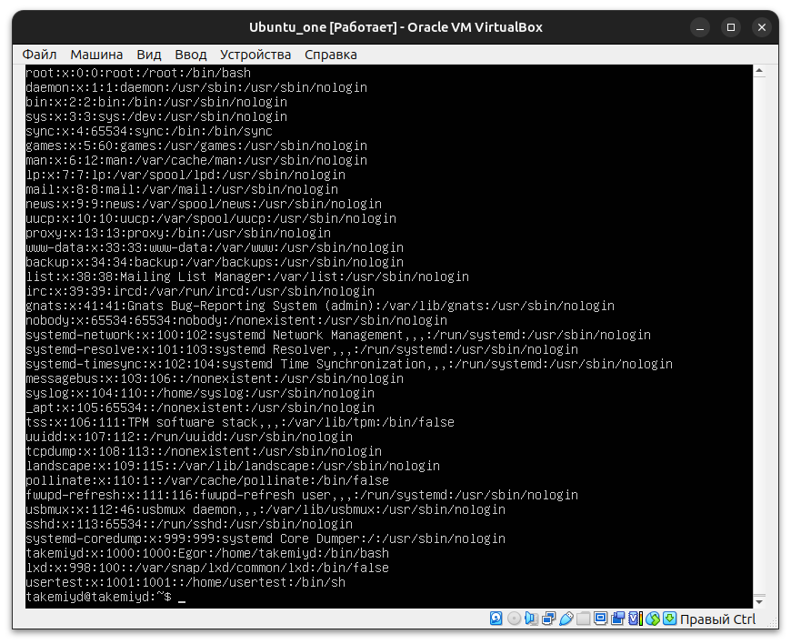
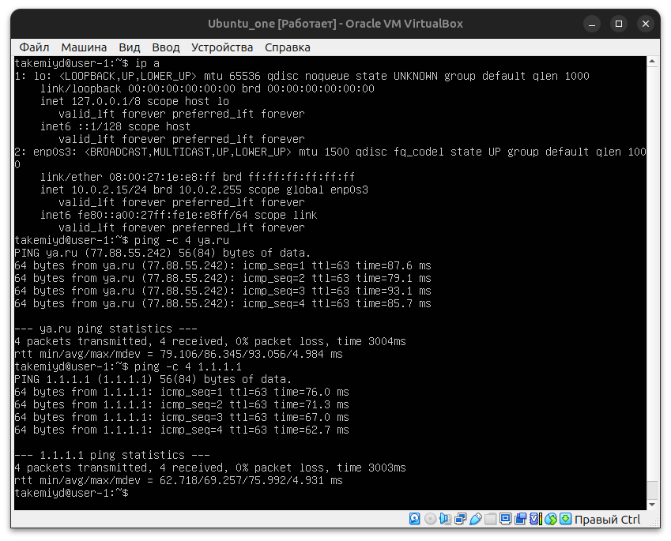
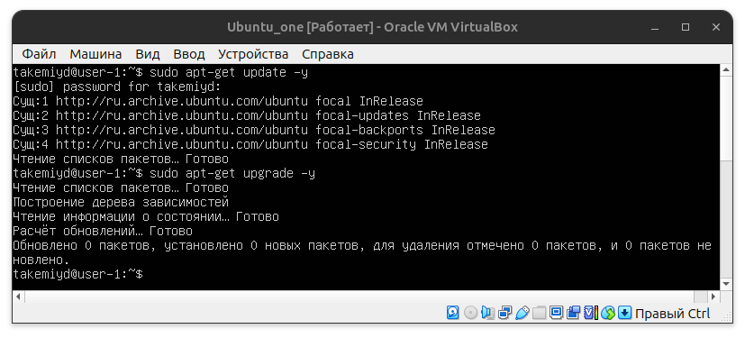
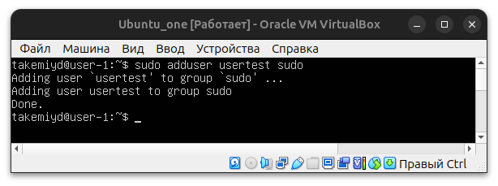
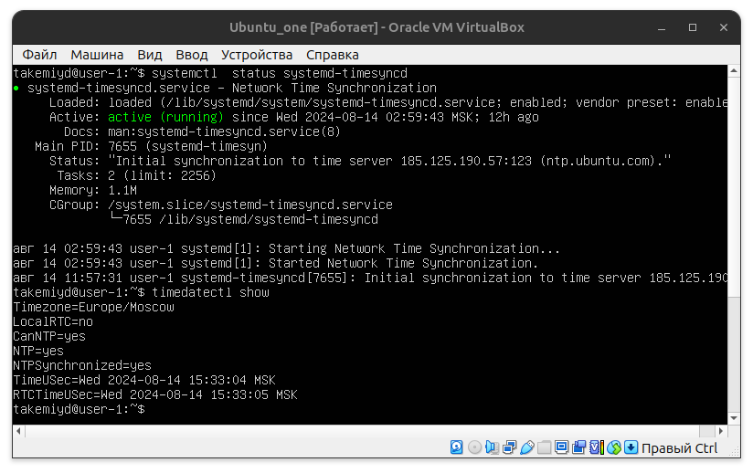
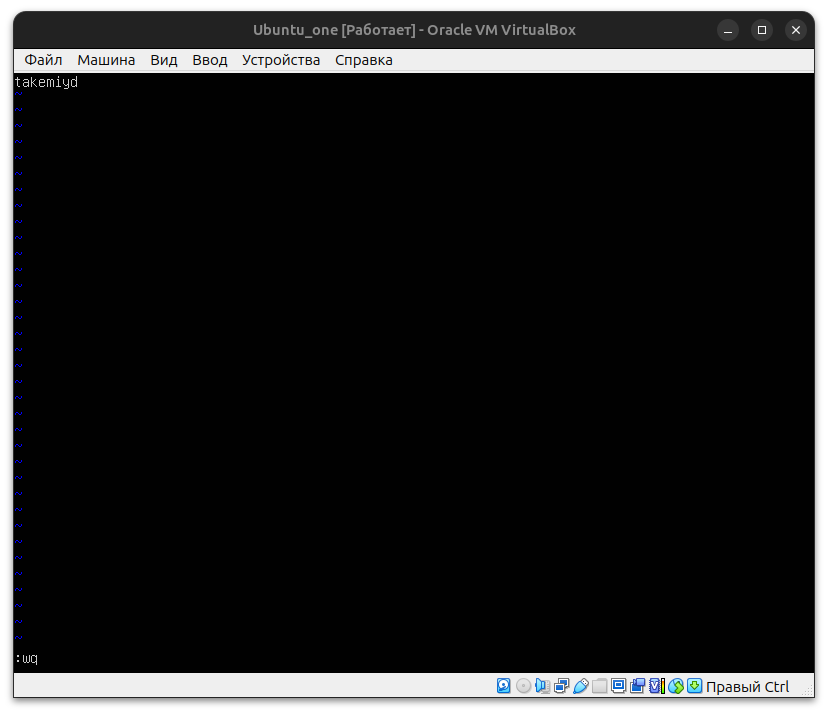
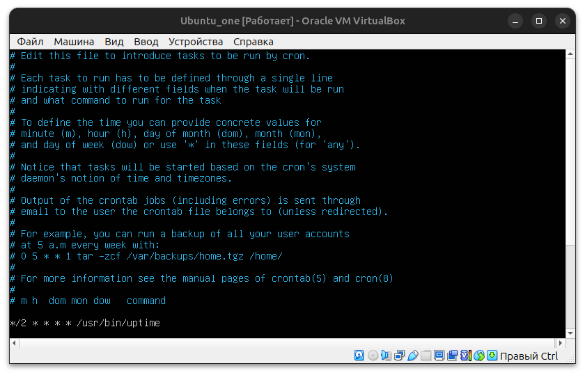
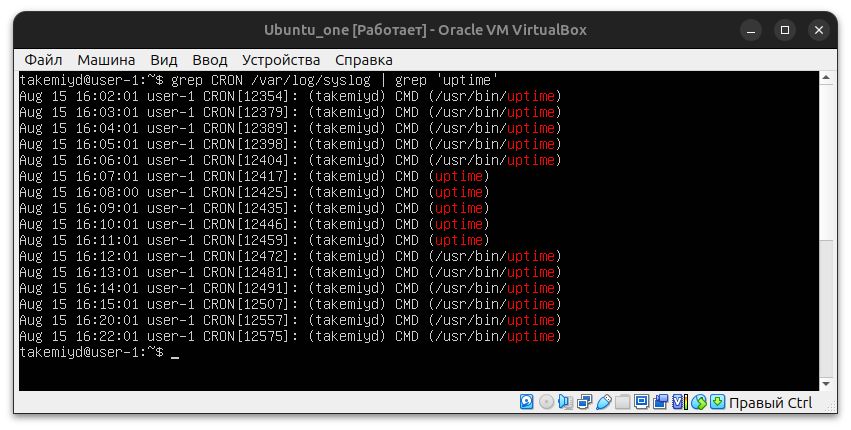

# Операционные системы UNIX/Linux (Базовый)

Установка и обновления системы Linux. Основы администрирования.


        
<div id="header" align="left">
  
</div>

## Требования к работе:

В качестве результата работы ты должен предоставить отчет по выполненным задачам. В каждой части задания указано, что необходимо поместить в отчёт после её выполнения. Это могут быть скриншоты, какие-то данные и т. д.
- В репозиторий, в папку src, должен быть загружен отчёт с расширением .md;
- В отчёте должны быть выделены все части задания, как заголовки 2-го уровня;
- В рамках одной части задания всё, что помещается в отчёт, должно быть оформлено в виде списка;
- Каждый скриншот в отчёте должен быть кратко подписан (что показано на скриншоте);
- Все скриншоты обрезаны так, чтобы была видна только нужная часть экрана.


## Задание №1. 
## Установи **Ubuntu 20.04 Server LTS** без графического интерфейса. (Используем программу для виртуализации — VirtualBox)

- Графический интерфейс должен отсутствовать.

- Узнай версию Ubuntu, выполнив команду \
`cat /etc/issue`
- Вставь скриншот с выводом команды.

## Выполнение:

1. Установка VirtualBox
    - `sudo apt-get install virtualbox`
    - [Полезная ссылка по установке и использованию](https://help.ubuntu.ru/wiki/virtualbox)
2. Установка сервера Ubuntu 20.04 Server
    - [Ссылка для скачивания сервера](https://ubuntu.com/download/server#architectures)
    - [Полезная ссылка для установки](https://www.nic.ru/help/ustanovka-ubuntu-server_11328.html)
3. `cat /etc/issue`
    - 

## Задание №2.
## Создание пользователя, отличного от созданного при установке. Пользователь должен быть добавлен в группу `adm`.
 
- Вставь скриншот вызова команды для создания пользователя.
- Новый пользователь должен быть в выводе команды \
`cat /etc/passwd`
- Вставь скриншот с выводом команды.

## Выполнение:

### 1. Посмотреть пользователей
1. Для начала я посмотрел, какие пользователи уже существуют в системе. Для этого есть несколько команд:

Примеры использования команд:

```bash
id
cat /etc/group
grep имя_пользователя /etc/group
```

- **Просмотр пользователей и групп:**
  - Команда `id` показывает группы к которым ты принадлежишь, а также их UID (уровень доступа).
  - Команда `cat /etc/group` показывает список всех групп и пользователей.
  - Команда `grep имя_пользователя /etc/group` позволяет найти группы, в которых состоит конкретный пользователь.

_Пользователи будут выделяться в командной строке вот так_ ***username:x:1000***

2. Затем можно добавить пользователя в систему.

Примеры использования команд:

```bash
adduser
useradd
```
- **Добавление пользователя:**
  - Команда `adduser` работает в интерактивном режиме, предлагая пользователю ввести данные (например, пароль, полное имя, номер комнаты и т. д.). 
  - Команда `useradd`не выполняет такие задачи, как создание домашнего каталога по умолчанию, настройка оболочки или запрос пароля для пользователя. Эти задачи нужно указывать в флагах.


Команда `sudo useradd -m -G adm -U usertest` создает домашнюю папку и добавляет пользователя _usertest_ в группу adm и собственную.

Вывод команды `cat /etc/passwd`




3. Бонусом добавлю полезные команды.

- `su - username` переходит на указанного пользователя.
- `sudo userdel -r username` удаляет пользователя вместе с его корневой папкой.
- `sudo passwd username` команда для установки пароля к указанному пользователю.
- `sudo gpasswd -d usertest adm` команда для удаления пользователя из группы. 


## Задание №3. Настройка сети ОС

### Задай название машины вида user-1.

В Linux host (или hostname) — это имя компьютера в сети. Это имя используется для идентификации устройства в сети например ip адрес машины 10.0.2.15 преобразовывается в user-1.local и может быть отображено в приглашении командной строки.

1. Просмотреть имя host
    - Команда `hostname`
    - Команда `cat /etc/hostname`
2. Заменить имя host
    - Команда `hostname new_name` делает это временно.
    - Открыть файл `/etc/hostname` с помощью редактора текста и заменить в нем имя хоста, делает это на постоянно.
3. Заменить имя localhost 
    - Открыть файл `/etc/hosts` с помощью редактора текста и заменить в нем имя хоста, делает это на постоянно.
4. `sudo reboot` перегрузить компьюктер.

### Установи временную зону, соответствующую твоему текущему местоположению.

1. Команда `timedatectl` показывает
    - Local time - местное время с учетом выбранной временной зоны 
    - Universal time: - универсальное время независимое от временной зоны
    - RTC time: - аппаратное время которое синхронизируется с UTC
    - Time zone: - временная зона которая синхронизируется с local time
2. Команда `timedatectl list-timezones | grep Moscow` покажет название временной зоны для города москвы вывод: `Europe/Moscow`
3. Команда `timedatectl set-timezones Europe/Moscow` установит временную зону по Московскому времени и синхронизирует local time.

Еще один способ синхранизовать время согласно твоей зоны.

1. 
```bash
sudo systemctl stop systemd-timesyncd
sudo systemctl disable systemd-timesyncd
```
отключаем службу времени

2. 
`sudo apt-get intall ntp`

устанавливаем ntp 

3. 
`sudo systemctl status ntp`

проверяем статус

`date` проверяем время.

##### Выведи названия сетевых интерфейсов с помощью консольной команды.

Команда которая выводит название сетевых интерфейсов `ifconfig` либо `ip addres`

Объяснение наличия интерфейса lo:

Интерфейс lo (loopback) — это специальный сетевой интерфейс, который используется для тестирования и диагностики сетевых сервисов на локальной машине. Он связан с IP-адресом 127.0.0.1, также известным как "localhost". Этот интерфейс позволяет программам и сервисам на компьютере общаться друг с другом через сетевые протоколы, не выходя на внешнюю сеть.

Почему интерфейс lo важен:

    Тестирование и разработка: lo позволяет разработчикам и системным администраторам тестировать сетевые приложения локально.

    Диагностика: Некоторые службы могут использовать этот интерфейс для внутреннего взаимодействия, даже если физическая сеть недоступна.
    
    Безопасность: Использование localhost или lo для привязки служб позволяет ограничить доступ к ним только с локальной машины, предотвращая доступ из внешней сети.

##### Используя консольную команду, получи ip адрес устройства, на котором ты работаешь, от DHCP-сервера. 
Расшифровка DHCP

DHCP (Dynamic Host Configuration Protocol) — это протокол сетевого управления, используемый для автоматического назначения IP-адресов и других сетевых настроек (таких как шлюз по умолчанию, DNS-серверы) устройствам в сети. DHCP упрощает процесс настройки сети, так как устраняет необходимость вручную конфигурировать IP-адреса на каждом устройстве.

Основные компоненты работы DHCP:

    DHCP-сервер: Сервер, который выдает IP-адреса и другие сетевые параметры.
    DHCP-клиент: Устройство, запрашивающее сетевые настройки.
    IP-аренда: Временный IP-адрес, выделяемый клиенту на определенный период.

Преимущества DHCP:

    Упрощение настройки сети: Автоматическая конфигурация IP-адресов.
    Устранение конфликтов IP-адресов: DHCP-сервер управляет пулом IP-адресов и следит за тем, чтобы каждый адрес был уникальным в сети.
    Удобство управления: Легкое управление и изменение сетевых настроек с одной точки — DHCP-сервера.

Команды для того чтобы узнать свой ip адрес устройства
- `hostanem -I`
- `sudo dhclient -v`
- `ip addres show`

##### Определи и выведи на экран внешний ip-адрес шлюза (ip) и внутренний IP-адрес шлюза, он же ip-адрес по умолчанию (gw).

1. Команда для запроса внешнего ip-адреса `curl ifconfig.me` http запрос ip адреса или `wget -qO- ifconfig.me`
2. Команда `ip route | grep default | cut -d ' ' -f 3` для получения внутреннего IP-адреса шлюза


##### Задай статичные (заданные вручную, а не полученные от DHCP-сервера) настройки ip, gw, dns (используй публичный DNS-серверы, например 1.1.1.1 или 8.8.8.8).  

`ip rout` посмотреть gateway
`ip -a` посмотреть addresses (inet) 

1. Открыл файл конфигурации netplan:

```bash
    sudo nano /etc/netplan/00-installer-config_yaml
```

2. Внес изменения в конфигурационный файл:

    ```yaml
    network:
      ethernets:
        enp0s3:
          dhcp4: no
          addresses: [10.0.2.15/24]
          gateway4: 10.0.2.2
          nameservers:
            addresses: [1.1.1.1, 8.8.8.8]
      version: 2
    ```

3. Применил изменения:

```bash
    sudo netplan apply
```

Перезагрузил виртуальную машину:

```bash
sudo reboot
```


##### Перезагрузи виртуальную машину. Убедись, что статичные сетевые настройки (ip, gw, dns) соответствуют заданным в предыдущем пункте.  



## Задача №4. Обновление ОС

### Обнови системные пакеты до последней на момент выполнения задания версии.  

- После обновления системных пакетов, если ввести команду обновления повторно, должно появиться сообщение о том, что обновления отсутствуют.
- Вставь скриншот с этим сообщением в отчёт.

## Выполнение.

Для выполнения обновлений необходимо выполнить несколько этапов
1. Выгрузить обновления списков пакетов
    - `apt-get update` обновляет данные о имеющихся обновлениях (вытаскивает из репозиториев данные о версиях)
2. Установить обновления.
    - `apt-get upgrade` обновить пакеты.



3. Бонус команды
    - `apt update`
    - `apt full-apgrade`
    - `apt-get dist-upgrade`
    - `apt-get autoremove`
    - `apt-get upgrade package-name`

<div>
    
</div>


## Задание №5. Использование команды **sudo**
## Разреши пользователю, созданному в [Задании 2](#задание-2),выполнять команду sudo.

- В отчёте объясни *истинное* назначение команды sudo (про то, что это слово — «волшебное», писать не стоит).
- Поменяй hostname ОС от имени пользователя, созданного в пункте [Part 2](#part-2-создание-пользователя) (используя sudo).
- Вставь скрин с изменённым hostname в отчёт.

## Выполнение.

1. Что такое sudo
    - Sudo – это утилита для операционных систем семейства Linux, позволяющая пользователю запускать программы с привилегиями другой учётной записи, как    правило, суперпользователя. sudo предоставляет только временное повышение привилегий. Таким образом, включая полномочия root’а только когда это действительно необходимо, применение команды sudo снижает вероятность того, что опечатка или ошибка в вызываемой команде причинит какой-нибудь вред системе. Непривилегированная учётная запись должна иметь некоторые полномочия в системе для того, чтобы иметь возможность воспользоваться командой sudo. Если быть более точным, такой пользователь должен состоять в определённой группе безопасности.
2. Поменять hostname от имени usertest созданного в пункте 2.
    - Используем команду `su имя_пользователя`
    - Используем команду `sudo nano /etc/hostname` получаем отказ в доступе.
<div id="header" align="center">
  
</div>

 Чтобы посмотреть кому доступны команды sudo можно открыть фалй etc/sudoers командой `sudo visudo` в нем мы увидим кому доступны команды sudo.
 Добавим нашего пользователя в группу sudo `sudo adduser usertest sudo`
    


 Пробуем поменять пользователя в `sudo nano /etc/hostname`  


<div id="header" align="center">
  
</div>


- [Полезная ссылка](https://ruvds.com/ru/helpcenter/znakomstvo-s-sudo/) про sudo


## Задание №6. Установка и настройка службы времени
## Настрой службу автоматической синхронизации времени.  

- Выведи время часового пояса, в котором ты сейчас находишься.
- Вывод следующей команды должен содержать `NTPSynchronized=yes`: \
  `timedatectl show`
- Вставь скрины с корректным временем и выводом команды в отчёт.

## Выполнение.

1. Если ввести команду `timedatectl show` с большей вероятностью она покажет тебе что синхранизация настроена, так как служба NTP устанавливается по умолчанию.
    - Предлагаю проверить командой `systemctl status systemd-timesyncd` статус установлен он или нет.
    - Если всё ОК то юзаем команду `timedatectl show` и видим что всё ОК.



## Задание №7. Установка и использование текстовых редакторов 

##### Установи текстовые редакторы **VIM** (+ любые два по желанию **NANO**, **MCEDIT**, **JOE** и т. д.)
##### Используя каждый из трех выбранных редакторов, создай файл *test_X.txt*, где X — название редактора, в котором создан файл. Напиши в нём свой никнейм, закрой файл с сохранением изменений.  
- В отчёт вставь скриншоты:
  - Из каждого редактора с содержимым файла перед закрытием.
- В отчёте укажи, что сделал для выхода с сохранением изменений.
##### Используя каждый из трех выбранных редакторов, открой файл на редактирование, отредактируй файл, заменив никнейм на строку «21 School 21», закрой файл без сохранения изменений.
- В отчёт вставь скриншоты:
    - Из каждого редактора с содержимым файла после редактирования.
- В отчёте укажи, что сделал для выхода без сохранения изменений.
##### Используя каждый из трех выбранных редакторов, отредактируй файл ещё раз (по аналогии с предыдущим пунктом), а затем освой функции поиска по содержимому файла (слово) и замены слова на любое другое.
- В отчёт вставь скриншоты:
    - Из каждого редактора с результатами поиска слова.
    - Из каждого редактора с командами, введёнными для замены слова на другое.

## Выполнение:

## Установка и запись в редакторах кода.

1. Установим редакторы
```bash
    sudo apt-get install vim, nano, joe
```
2. Создание и сохранение файла с никнеймом в VIM
    
    Запускаю редактор VIM:

    <div id="header" align="center">
        
    </div>

    `vim test_vim.txt`

    Перехожу в режим редактирования, нажав клавишу i и ввожу свой ник.

    Сохраняю файл и выхожу:
        Нажимаю Esc для выхода из режима редактирования.
        Ввожу :wq и нажимаю Enter.



3. Создание и сохранение файла с никнеймом в NANO

    Запускаю редактор NANO

    `nano test_nano.txt`

    Ввожу свой никнейм

    Сохраняю файл и выхожу:

        Нажимаю Ctrl + O для сохранения.
        Нажимаю Enter для подтверждения имени файла.
        Нажимаю Ctrl + X для выхода из редактора.


2.3. Создание и сохранение файла с никнеймом в JOE

    Запускаю редактор JOE:

    `joe test_joe.txt

    Ввожу свой никнейм
    
    Сохраняю файл и выхожу:

    Нажимаю Ctrl + K, затем X для сохранения и выхода.


## Редактирование без сохранения в редакторах кода.

1. Редактирование файла в VIM

    Переходим в режим вставки, нажав i и меняем никнейм на «21 School 21»

    Для выхода без сохранения изменений:

        Нажимаю Esc, чтобы выйти из режима вставки.
        Ввожу :q! и нажимаю Enter.


2. Редактирование файла в NANO

    Открываю файл и меняю никнейм на 21 School 21

    Для выхода без сохранения изменений:

        Нажимаю Ctrl + X.
        Когда появится запрос на сохранение изменений, нажимаю N.


3. Редактирование файла в JOE

    Открываю файл и меняю никнейм на 21 School 21:

    Для выхода без сохранения изменений:

        Нажимаю Ctrl + C, затем Ctrl + K и Q для выхода.


## Поиск и замена слов

Теперь откроем файлы ещё раз, найдем в них слово и заменим его на другое.

1. Поиск и замена в VIM

    Для поиска слова перейдем в режим команд, нажав Esc.

        Введу /<слово> и нажимаю Enter, чтобы найти слово.


    Для замены слова использую команду:

        Ввожу :%s/<старое_слово>/<новое_слово>/g и нажимаю Enter.


2. Поиск и замена в NANO

    Для поиска слова нажимаю Ctrl + W, ввожу слово и нажимаю Enter.


    Для замены нажимаю Ctrl + \, ввожу старое и новое слово, затем нажимаю Enter.


3. Поиск и замена в JOE

Для поиска нажмите Ctrl + K, затем F, введите слово и нажмите Enter.


Для замены нажмите Ctrl + K, затем F, нажать R ввести новое слово для замены и нажать Enter потом Y


## Задание №8. Установка и базовая настройка сервиса **SSHD**

##### Установи службу SSHd.  
##### Добавь автостарт службы при загрузке системы.  
##### Перенастрой службу SSHd на порт 2022.  
##### Используя команду ps, покажи наличие процесса sshd. Для этого к команде нужно подобрать ключи.
- В отчёте объясни значение команды и каждого ключа в ней.
##### Перезагрузи систему.
- В отчёте опиши, что сделал для выполнения всех пяти пунктов (можно как текстом, так и скриншотами).
- Вывод команды netstat -tan должен содержать  \
`tcp 0 0 0.0.0.0:2022 0.0.0.0:* LISTEN`  \
(если команды netstat нет, то ее нужно установить).
- Скрин с выводом команды вставь в отчёт.
- В отчёте объясни значение ключей -tan, значение каждого столбца вывода, значение 0.0.0.0.

## Выполнение

1. Установи службу SSHd
    - `sudo systemctl status ssh` проверим статус работы sshd servera
    - Если ssh server не установлен юзаем следующие команды
    ```bash
        sudo apt-get update
        sudo apt-get install openssh-server
    ```
2. Добавим автостарт службы ssh
    - `sudo systemctl enable ssh` устанавливает автостарт
    - `ssh localhost` соединяемся со своей машиной через ssh протокол чтобы проверить все ли работает нормально.

3. Перенастрой службы SSHd на порт 2022.

- Сохраним изначальные настройки чтобы ничего не попортить.

``` bash
    sudo cp /etc/ssh/sshd_config
    /etc/ssh/sshd_config.factory-defaults
```
- Запустим через редактор текста файл `/etc/ssh/sshd_config` и заменим в нем строку #port 22 на port 2022
- Перезапустить ssh server для того чтобы изменения вступили в силу `sudo systemctl restart ssh`
- Можно приконектиться заного и проверить порт `ssh -p 2022 takemiyd@user-1`

4. Разбор ключей в команде `ps aux | grep sshd`:

    `ps`: Отображает информацию о работающих процессах.

    `a`: Отображает процессы, запущенные всеми пользователями.
    
    `u`: Показывает информацию о пользователе, запустившем процесс, а также о CPU и памяти, которые процесс использует.
    
    `x`: Отображает процессы, которые не связаны с терминалом.

`ps aux` выводит полный список процессов, запущенных в системе.
`| grep sshd` используется для фильтрации этого списка, чтобы остались только строки, содержащие sshd.

5. Перезапустить систему запустить команду `netstat -tan`

1. `sudo reboot` перегружаем систему
 


Объяснение вывода команды netstat -tan

Значение ключей `-tan`:

-   t: Показывает только TCP-соединения.
-   a: Отображает все активные соединения и порты, на которых идет прослушивание.
-   n: Показать адреса и порты в числовом виде (без преобразования в DNS-имена).

Значение каждого столбца вывода:
- tcp: Протокол соединения.
- 0: Размер очереди отправки (Send-Q). Показывает, сколько данных ожидает отправки.
- 0: Размер очереди получения (Recv-Q). Показывает, сколько данных ожидает получения.
- 0.0.0.0:2022: Локальный IP-адрес и порт, на котором идет прослушивание. В данном случае 0.0.0.0 означает, что прослушиваются все доступные IP-адреса на машине, а 2022 — это порт, на котором работает SSH.
- 0.0.0.0:*: Удаленный IP-адрес и порт, с которым может быть установлено соединение. Символ * означает, что можно соединяться с любым удаленным IP-адресом и портом.
- LISTEN: Состояние сокета, указывающее, что данный порт ожидает входящих соединений.

SSH настроен для прослушивания на порту 2022 и принимает соединения как по IPv4, так и по IPv6.

[Полезная ссылка про ssh](https://selectel.ru/blog/ssh-ubuntu-setup/)


## Задание 9. Установка и использование утилит **top**, **htop**

##### Установи и запусти утилиты top и htop. 

- По выводу команды top определи и напиши в отчёте:
  - uptime,
  - количество авторизованных пользователей,
  - общую загрузку системы,
  - общее количество процессов,
  - загрузку cpu,
  - загрузку памяти,
  - pid процесса занимающего больше всего памяти,
  - pid процесса, занимающего больше всего процессорного времени.
- В отчёт вставь скрин с выводом команды htop:
  - отсортированному по PID, PERCENT_CPU, PERCENT_MEM, TIME;
  - отфильтрованному для процесса sshd;
  - с процессом syslog, найденным, используя поиск;
  - с добавленным выводом hostname, clock и uptime. 

## Выполнение.

1. Запустить команду `top`
    - uptime Uptime — это время, в течение которого система работает без перезагрузки. Uptime указан в верхней строке вывода команды top после времени суток. У меня 1:01
    - Количество активных пользователей указано сразу после uptime в верхней строке вывода. У меня 1.
    - Общая загрузка системы (Load Average) отображается в верхней строке после информации об авторизованных пользователях. Показаны средние значения за последние 1, 5 и 15 минут у меня 0. 0. 0.
    - Общее количество процессов указано в строке Tasks. Там показано количество активных, спящих, остановленных и зомби-процессов. У меня 99 спят и 1 работает.
    - Загрузка CPU отображается в строке %Cpu(s). Она показывает процент использования CPU для различных задач, включая пользовательские, системные, иdle процессы и т. д. У меня системные 0.1 все остальное по 0.
    - Использование памяти указано в строке Mem, где показаны общее количество памяти, используемая, свободная и буферизированная память. Я выделил 1900 из них 1600 свободно.
    - PID процесса, занимающего больше всего памяти: Чтобы отсортировать по столбцу MEM можно использовать Shift+M. Его PID 664 это приложение SNAPD
    - PID процесса, занимающего больше всего процессорного времени: Процессы можно отсортировать по использованию CPU, нажав Shift+P. Его PID 1538 само приложение TOP грузит процессор.

2. Запустить команду `htop`

Для сортировки по PID нажать F6 и выбрать PID.


Для сортировки по PERCENT_CPU нажать Shift + P или нажать F6 и выбрать PERCENT_CPU.


Для сортировки по PERCENT_MEM нажать Shift + M или нажать F6 и выбрать PERCENT_MEM.


Для сортировки по TIME нажать Shift + T или нажать F6 и выбрать TIME.


Фильтр sshd, нажать F4, чтобы открыть фильтр, и ввести sshd.


Поиск syslog, нажать F3, чтобы открыть поиск, и ввести syslog.


Добавить вывод hostname, clock и uptime: Для этого нажать F2, чтобы войти в режим настройки. Выбери опции Hostname, Clock, и Uptime в списке справа и перемести их в любую колонку слева.


## Задание 10. Использование утилиты **fdisk**

##### Запусти команду fdisk -l.

- В отчёте напиши название жесткого диска, его размер и количество секторов, а также размер swap.

## Выполнение.

- Название жесткого диска VBOX HARDISK, его размер 15.1GiB или 16213501440 bytes, 31666995 sectors SWAP отсутствует.

## Задание 11. Использование утилиты **df** 

##### Запусти команду df.  
- В отчёте напиши для корневого раздела (/):
  - размер раздела,
  - размер занятого пространства,
  - размер свободного пространства,
  - процент использования.
- Определи и напиши в отчёт единицу измерения в выводе.  

##### Запусти команду df -Th.
- В отчёте напиши для корневого раздела (/):
    - размер раздела,
    - размер занятого пространства,
    - размер свободного пространства,
    - процент использования.
- Определи и напиши в отчёт тип файловой системы для раздела.

## Выполнение.
1. `df /`
    - 10218772 KiB
    - 4825332 KiB
    - 4852768 KiB
    - Use 50 %
2. `df -Th /`
    - 9.8 GiB
    - 4.7 GiB
    - 4.7 GiB
    - Use 50%
    - Type ext4

## Задание 12. Использование утилиты **du**

##### Запусти команду du.
##### Выведи размер папок /home, /var, /var/log (в байтах, в человекочитаемом виде).
##### Выведи размер всего содержимого в /var/log (не общее, а каждого вложенного элемента, используя *).

## Выполнение.

1. `du` показывает размер всех файлов в корневой системе начиная с директории в которой запускается.


2. `sudo du -sh /home /var /var/log` выводит размер папок с указанием размера.


3. `sudo du -sh /var/log/*`


## Part 13. Установка и использование утилиты **ncdu**

##### Установи утилиту ncdu.
##### Выведи размер папок /home, /var, /var/log.

- Размеры должны примерно совпадать с полученными в [Part 12](#part-12-использование-утилиты-du).

- В отчёт вставь скрины с выводом использованных команд.

## Выполнение.

1. `sudo apt install ncdu` установка утилиты


2. `sudo ncdu /home` 


3. `sudo ncdu /var` 


4. `sudo ncdu /var/log`


## Part 14. Работа с системными журналами

##### Открой для просмотра:
##### 1. /var/log/dmesg
##### 2. /var/log/syslog
##### 3. /var/log/auth.log  

- Напиши в отчёте время последней успешной авторизации, имя пользователя и метод входа в систему.
- Перезапусти службу SSHd.
- Вставь в отчёт скрин с сообщением о рестарте службы (искать в логах).

## Выполнение.
Системные журналы - это файлы, в которых хранятся все события и процессы, происходящие с файлами, работа оборудования и т.д. \
Системных журналов много и все они расположены в директории /var/log/. \
Чтобы посмотреть логи, удобно использовать несколько утилит командной строки Linux. Вот команды, которые чаще всего используются для этих целей:
- less
- more
- cat
- head
- grep
- tail
- zcat
- zgrep
- zmore
- vi
- nano

Рассмотрим некоторые из них на примере лога /var/log/dmesg:
- less -- просмотр логов с возможностью прокрутки: \
- tail -- просмотр логов в реальном времени
- cat -- открытие лог файла
- head -- просмотр первых строки лога
- grep -i error -- вывод только ошибок из лога: \

1. `sudo nano /var/log/dmesg` Лог отображает сообщения ядра, включая информацию о загрузке системы.
2. `sudo nano /var/log/syslog` Лог содержит системные сообщения, включая информацию о различных службах и их статусе.
3. `sudo nano /var/log/auth.log` Лог записывает события, связанные с авторизацией и аутентификацией пользователей.

- Посмотреть логин 

В nano нажимаю Ctrl + W для вызова строки поиска.
Ввожу Accepted и нажми Enter, чтобы найти строки с успешной авторизацией.

`Aug 14 21:48:07 user-1 sshd[24987]: Accepted password for takemiyd from 127.0.0.1 port 49528 ssh2`

- Перезапустить службу SSHd

`sudo systemctl restart ssh` перезапускаем службу
можно посмотреть сам файл лог `sudo nano /var/log/syslog` в последних записях будет написано о перезагрузки SSHd либо использовать комаду `sudo 


## Задание 15. Использование планировщика заданий **CRON**

##### Используя планировщик заданий, запусти команду uptime через каждые 2 минуты.
- Найди в системных журналах строчки (минимум две в заданном временном диапазоне) о выполнении.
- Выведи на экран список текущих заданий для CRON.
- Вставь в отчёт скрины со строчками о выполнении и списком текущих задач.

##### Удали все задания из планировщика заданий.
- В отчёт вставь скрин со списком текущих заданий для CRON.

## Выполнение.

Запустить CRON

```bash
    crontab -e
```
Записать задачу на выполнение `*/2 * * * * /usr/bin/uptime`



Находим в логах выполнение задачи демона CRON `grep CRON /var/log/syslog | grep 'uptime'`



Удаляем все задания из CRON 

`crontab -r`


