# Simple Docker

## Chapter II

### **nginx**

**nginx** (произносится как «engine-x») — это обратный прокси-сервер с открытым исходным кодом для протоколов HTTP, HTTPS и т. д.
**nginx** также используется, как балансировщик нагрузки, веб-сервер и для кеширования HTTP.
В проекте **nginx** уделяется особое внимание высокому параллелизму, высокой производительности и низкому использованию памяти.

У **nginx** есть один главный и несколько рабочих процессов.
Основная задача главного процесса — чтение и проверка конфигурации и управление рабочими процессами.
Рабочие процессы выполняют фактическую обработку запросов.

Как работают **nginx** и его модули, определяется в конфигурационном файле. По умолчанию конфигурационный файл называется *nginx.conf*.

### **Docker**

Контейнер – новый «исполняемый файл», включающий в себя все необходимые продукту зависимости. \
Главное преимущество контейнеризации – изоляция зависимостей и единая простая точка запуска ПО.

Основные понятия:
- Докер-образ – «упаковка» для приложения и зависимостей (в том числе системных).
- Контейнер – экземпляр образа, то есть «оживший» образ.

**Docker** — это платформа, которая предназначена для разработки, развёртывания и запуска приложений в контейнерах.
**Docker** – «де-факто» стандарт инструмента контейнеризации в индустрии, но он не является первым или последним среди технологий контейнеризации.

Предшественниками контейнеров **Docker** были виртуальные машины.
Виртуальная машина, как и контейнер, изолирует приложение и его зависимости от внешней среды.
Однако контейнеры **Docker** обладают преимуществами перед виртуальными машинами.
Так, они потребляют меньше ресурсов, их очень легко переносить, они быстрее запускаются и приходят в работоспособное состояние.

Докер-образ состоит из слоев. Каждый слой описывает какое-то изменение, которое должно быть выполнено с данными на запущенном контейнере.
Структура связей между слоями — иерархическая. Имеется базовый слой, на который «накладываются» остальные слои.
Для создания образа используется *Dockerfile*. Каждая инструкция в нем создает новый слой.

### **Dockle**

**Dockle** — это инструмент для проверки безопасности образов контейнеров, который можно использовать для поиска уязвимостей.

Основные функции и преимущества **Dockle**:
- поиск уязвимостей в образах;
- помощь в создании правильного Dockerfile;
- простота в использовании, нужно указать только имя образа;
- поддержка *CIS Benchmarks*.

### **Docker Compose**

Docker Compose — это инструментальное средство, которое предназначено для решения задач, связанных с развёртыванием проектов.
Docker Compose может пригодиться, если для обеспечения функционирования проекта используется несколько сервисов.

Docker Compose используется для одновременного управления несколькими контейнерами, входящими в состав приложения.
Этот инструмент предлагает те же возможности, что и Docker, но позволяет работать с более сложными распределенными приложениями, например микросервисными.


## Chapter III

В качестве результата работы по первым двум задачам должен быть предоставлен отчет.
В каждой части задания указано, что должно быть помещено в отчёт, после её выполнения.
Это могут быть ответы на вопросы, скриншоты и т. д.

В качестве результата работы по третьей задаче должны быть предоставлены исходные файлы для запуска веб-сервера.

В качестве результата работы по четвёртой и пятой задачам должны быть предоставлены докерфайлы.

В качестве результата работы по шестой задаче должен быть предоставлен файл *docker-compose.yml* и нужные для его запуска докерфайлы (если они не были предоставлены ранее).

- В репозиторий, в папку src, должен быть загружен отчёт с расширением .md;
- В отчёте должны быть выделены все части задания, как заголовки 2-го уровня;
- В рамках одной части задания всё, что помещается в отчёт, должно быть оформлено в виде списка;
- Каждый скриншот в отчёте должен быть кратко подписан (что показано на скриншоте);
- Все скриншоты обрезаны так, чтобы была видна только нужная часть экрана;
- На одном скриншоте допускается отображение сразу нескольких пунктов задания, но они все должны быть описаны в подписи к скриншоту;
- В репозиторий, в папку src/server, должны быть загружены исходные файлы для запуска веб-сервера из третьего задания;
- В репозиторий, в папку src, должны быть загружены итоговые докерфайлы для запуска образов из четвёртого и пятого заданий;
- В репозиторий, в папку src, должен быть загружен *docker-compose.yml* шестого задания;
- Необходимо быть готовым продемонстрировать решение вживую при необходимости.

## Задание №1  Готовый докер

В качестве конечной цели своей небольшой практики ты сразу выбрал написание докер-образа для собственного веб-сервера, а потому в начале тебе нужно разобраться с уже готовым докер-образом для сервера.
Твой выбор пал на довольно простой **nginx**.

**== Задание ==**

##### Возьми официальный докер-образ с **nginx** и выкачай его при помощи `docker pull`.
##### Проверь наличие докер-образа через `docker images`.
##### Запусти докер-образ через `docker run -d [image_id|repository]`.
##### Проверь, что образ запустился через `docker ps`.
##### Посмотри информацию о контейнере через `docker inspect [container_id|container_name]`.
##### По выводу команды определи и помести в отчёт размер контейнера, список замапленных портов и ip контейнера.
##### Останови докер контейнер через `docker stop [container_id|container_name]`.
##### Проверь, что контейнер остановился через `docker ps`.
##### Запусти докер с портами 80 и 443 в контейнере, замапленными на такие же порты на локальной машине, через команду *run*.
##### Проверь, что в браузере по адресу *localhost:80* доступна стартовая страница **nginx**.
##### Перезапусти докер контейнер через `docker restart [container_id|container_name]`.
##### Проверь любым способом, что контейнер запустился.

- В отчёт помести скрины:
  - вызова и вывода всех использованных в этой части задания команд;
  - стартовой страницы **nginx** по адресу *localhost:80* (адрес должен быть виден).
  
*Замечание:* **Не загружай тяжелые файлы (>10 мб) в гит.**

## Выполнение

- Скачаем nginx c помощью команды `docker pull nginx`

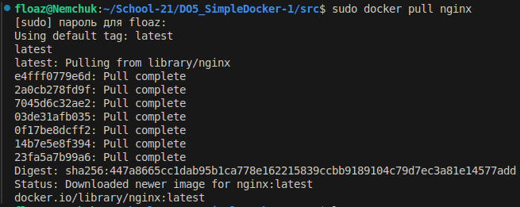

- Проверим наличие докер-образа через `docker images`. Эта команда покажет список всех доступных Docker-образов на нашей системе, включая скачанный образ NGINX.

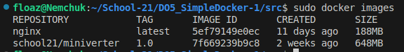

- Запустим докер-образ через команду `docker run -d nginx`. 

Команда RUN:
1. Cкачивает (pull) образ nginx: Docker Engine проверяет наличие образа nginx в кеше на
хосте, на котором работает Docker Engine. Если образ уже существует локально, Docker Engine
использует его для запуска нового контейнера. В противном случае Docker Engine скачивает этот
образ с Docker Store.
2. Создает новый контейнер: Docker использует указанный образ для создания контейнера.
3. Выделяет место на файловой системе хоста и монтирует слой доступный для
записи: Контейнер создан на файловой системе и доступный для записи слой добавлен к его
образу.
4. Выделяет сетевой / bridge интерфейс: Создает сетевой интерфейс, который позволяет контейнеру взаимодействовать с локальным хостом, на котором установлен Docker Engine.
5. Назначает IP адрес: Находит и присоединяет доступный IP-адрес из пула.
6. Docke флаг -d означает, что контейнер будет запущен в фоновом режиме (detach mode) и не покажет вам лог ошибок так как запущен в фоновом режиме.

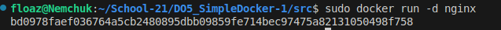

- Проверим, что образ запустился через команду  `docker ps`.

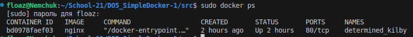

- Посмотрим информацию о контейнере через команжу `docker inspect [name]`
.

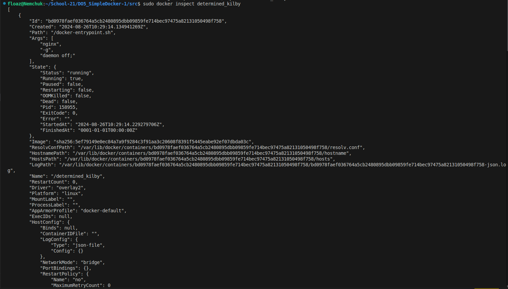

- В выводе команды мы сможем найти следующие параметры:

    - Размер контейнера: Поле "SizeRootFs".

    - Список замапленных портов: Поле "Ports".

    - IP-адрес контейнера: Поле "IPAddress".

Для того чтобы вывести поле размера контейнера используем следующую команду `docker inspect --sisze  [name] --format '{{ .SizeRootFs }}'`

и команду `docker inspect --sisze  [name] --format '{{ .SizeRw }}'` 

где: 
- `'{{ .SizeRootFs }}'` общий размер всех файлов в контейнере, в байтах. 
- `'{{ .SizeRw }}'`: размер файлов, которые были созданы или изменены в контейнере, по сравнению с его образом, в байтах.

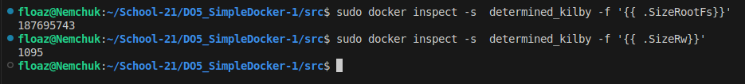

Для того чтобы вывести IPAddress контейнера введем команду `sudo docker inspect --format='{{range .NetworkSettings.Networks}}{{.IPAddress}}{{end}}' [name]`


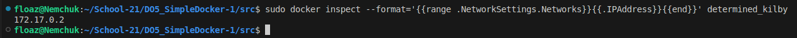

Для того чтобы вывести порты используем команду `sudo docker inspect --format='{{ .NetworkSettings.Ports}}' [name]`


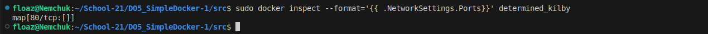

- Остановим докер контейнер через `docker stop [name]`
 и проверим что контейнер остановился через `docker ps`.

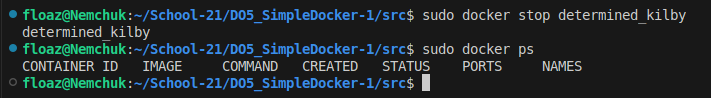

- Запустим докер с портами 80 и 443 в контейнере, замапленными на такие же порты на локальной машине, через команду *run*.

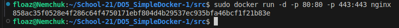

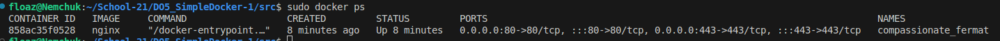

- Проверим, что в браузере по адресу *localhost:80* доступна стартовая страница **nginx**.

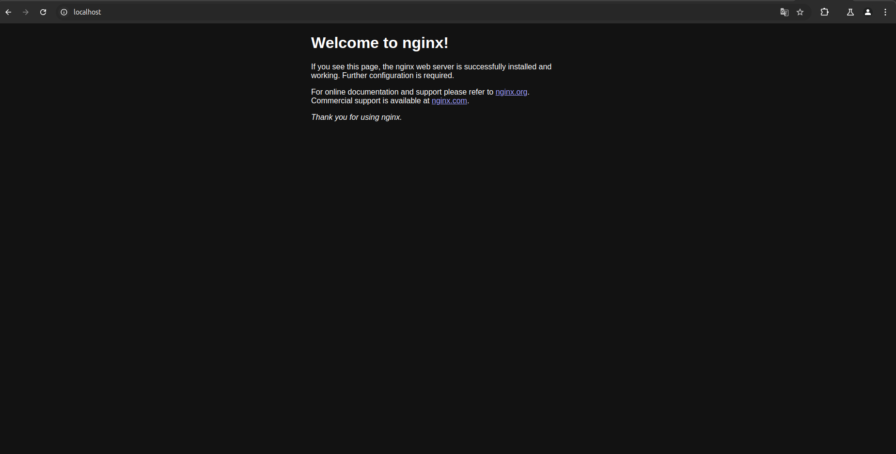

- Перезапустим докер контейнер через `docker restart [name]`
- Проверим через команду `docker ps`, что контейнер запустился.

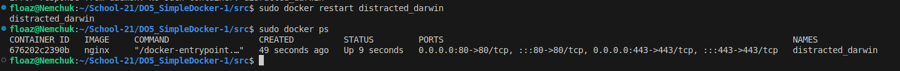

## Part 2. Операции с контейнером

Докер-образ и контейнер готовы. Теперь можно покопаться в конфигурации **nginx** и отобразить статус страницы.

**== Задание ==**

##### Прочитай конфигурационный файл *nginx.conf* внутри докер контейнера через команду *exec*.
##### Создай на локальной машине файл *nginx.conf*.
##### Настрой в нем по пути */status* отдачу страницы статуса сервера **nginx**.
##### Скопируй созданный файл *nginx.conf* внутрь докер-образа через команду `docker cp`.
##### Перезапусти **nginx** внутри докер-образа через команду *exec*.
##### Проверь, что по адресу *localhost:80/status* отдается страничка со статусом сервера **nginx**.
##### Экспортируй контейнер в файл *container.tar* через команду *export*.
##### Останови контейнер.
##### Удали образ через `docker rmi [image_id|repository]`, не удаляя перед этим контейнеры.
##### Удали остановленный контейнер.
##### Импортируй контейнер обратно через команду *import*.
##### Запусти импортированный контейнер.
##### Проверь, что по адресу *localhost:80/status* отдается страничка со статусом сервера **nginx**.

- В отчёт помести скрины:
  - вызова и вывода всех использованных в этой части задания команд;
  - содержимое созданного файла *nginx.conf*;
  - страницы со статусом сервера **nginx** по адресу *localhost:80/status*.

## Выполнение

- Прочитаем конфигурационный файл *nginx.conf* внутри докер контейнера через команду `docker exec -it name bash`
    - команда `docker exec` позволяет выполнять команды внутри развернутого контейнера, 
    - флаги `-i` и `-t`  запускают интерактивную консоль
    - команда `bash` запускает оболочку для самостоятельного управления контейнером.
    - следующей командой откроем сам конфиг `cat /etc/nginx/nginx.conf`
    
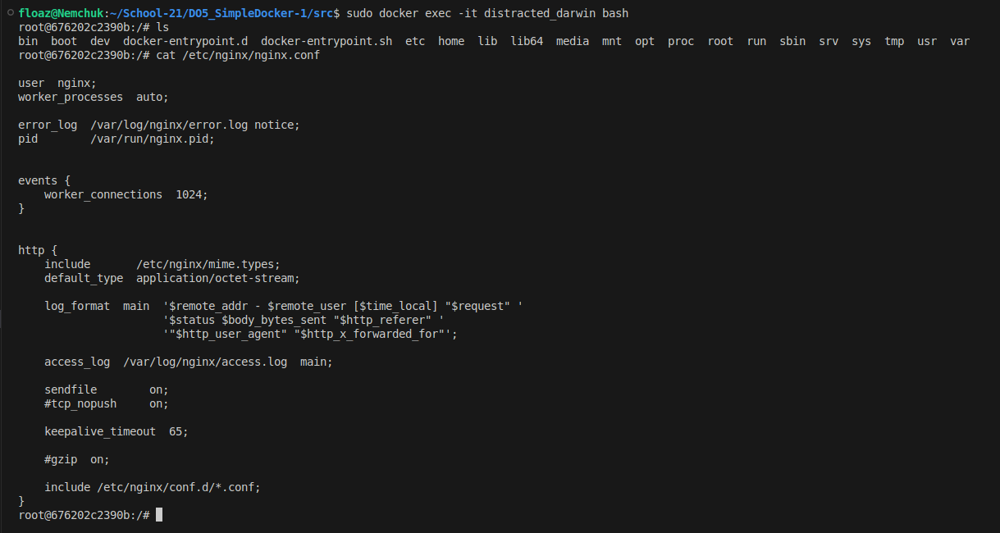


- Создадим на локальной машине файл *nginx.conf* и настроем в нем по пути */status* отдачу страницы статуса сервера **nginx**.

Чтобы настроить Nginx на возвращение страницы статуса по пути /status, нужно добавить специальную локацию в секцию http. Эта локация будет использовать модуль stub_status, который предоставляет информацию о текущем состоянии сервера.


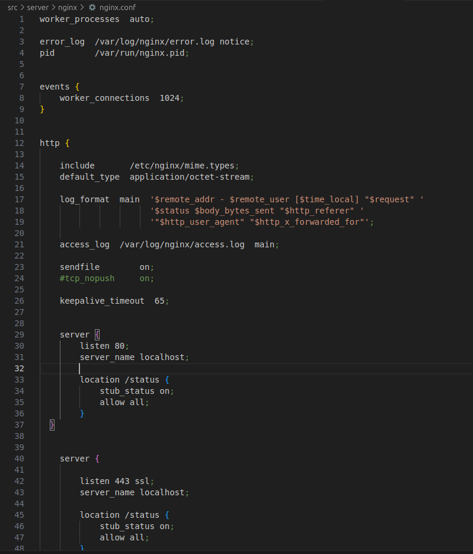

- Скопируем созданный файл *nginx.conf* внутрь докер-образа через команду `docker cp nginx.conf [name]:/etc/nginx/nginx.conf`.
- Перезапусти **nginx** внутри докер-образа через команду `docker exec [name] nginx -s reload`.

- Проверим, что по адресу *localhost:80/status* отдается страничка со статусом сервера **nginx**.

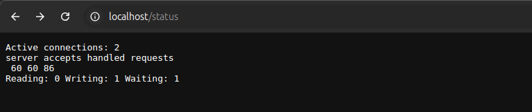

- экспортируем контейнер в файл *container.tar* через команду `docker export -o container.tar [container_id]`

Экспорт контейнера означает сохранение состояния файловой системы контейнера в виде архивного файла (обычно в формате .tar). Экспорт не сохраняет метаданные Docker, такие как конфигурация контейнера, его история или слои образа. Экспортируется только файловая система контейнера на момент выполнения команды.

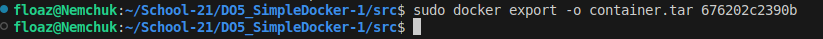

- Остановим контейнер с помощью команды `docker stop [name]`

- Удалим образ через `docker rmi --force [image_id|repository]`, не удаляя перед этим контейнеры.
Используем флаг -f потому что у нас есть контейнер который не удален и использует образ nginx.

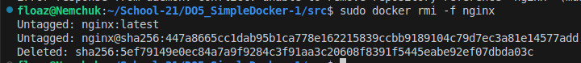

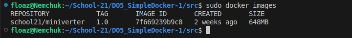

- Удалим остановленный контейнер командой `sudo docker rm [name]`

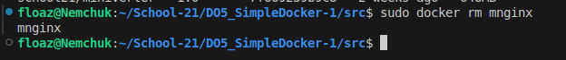

- Импортируем контейнер обратно через команду `docker import container.tar [new_image_name]`

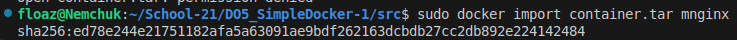

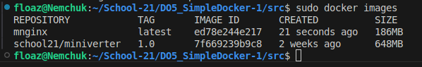

- Запустим импортированный контейнер командой `sudo docker run -d -p 80:80 -p 443:443 --name nginx1 mnginx nginx -g "daemon off;"`

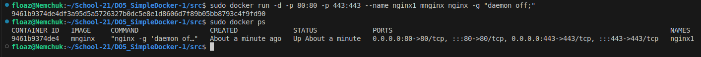

- Проверь, что по адресу *localhost:80/status* отдается страничка со статусом сервера **nginx**.

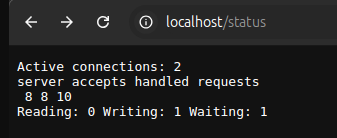

## Part 3. Мини веб-сервер

Теперь стоит немного оторваться от докера, чтобы подготовиться к последнему этапу. Время написать свой сервер.

**== Задание ==**

##### Напиши мини-сервер на **C** и **FastCgi**, который будет возвращать простейшую страничку с надписью `Hello World!`.
##### Запусти написанный мини-сервер через *spawn-fcgi* на порту 8080.
##### Напиши свой *nginx.conf*, который будет проксировать все запросы с 81 порта на *127.0.0.1:8080*.
##### Проверь, что в браузере по *localhost:81* отдается написанная тобой страничка.
##### Положи файл *nginx.conf* по пути *./nginx/nginx.conf* (это понадобится позже).

## Выполнение 

- Напишем мини сервер на C с библиотекой FastCgi который будет возвращать простейшую страничку с надписью Hello World!.

Установим FastCgi приложение командой `sudo apt-get install libfcgi-dev`

Создадим файл hello.c и напишем в нем следующий код:

```C

#include <fcgi_stdio.h>

int main() {
    while (FCGI_Accept() >= 0) {
        printf("Content-type: text/html\r\n\r\n");
        printf("Hello World!");
    }
    return 0;
}

```

Этот код принимает HTTP-запросы и для каждого запроса возвращает страницу с текстом "Hello World!". Сервер работает в бесконечном цикле и отвечает на каждый запрос одинаковым сообщением.

```C
while (FCGI_Accept() >= 0)` 
```

Эта строка запускает бесконечный цикл, который ожидает входящие запросы. `FCGI_Accept()` обрабатывает новый запрос и возвращает неотрицательное значение, если запрос был успешно принят. Цикл продолжается, пока `FCGI_Accept()` возвращает положительное число или ноль.

```c
printf("Content-type: text/html\r\n\r\n");
printf("Hello World!");
```

Внутри цикла сервер отправляет HTTP-ответ.

Первая строка printf("Content-type: text/html\r\n\r\n"); устанавливает заголовок ответа, указывая, что содержимое ответа будет в формате HTML.

Вторая строка printf("Hello World!"); отправляет текст "Hello World!" в теле ответа.

- Запустим написанный мини-сервер через *spawn-fcgi* на порту 8080.

Установим приложение spawn-fcgi с помощью команды `sudo apt install spawn-fcgi`

Команда spawn-fcgi запускает FastCGI-приложение и связывает его с портом 8080. Это означает, что приложение начинает слушать входящие HTTP-запросы на этом порту.

Когда клиент отправляет HTTP-запрос на наш сервер (например, http://localhost:8080), запрос перенаправляется на FastCGI-приложение.

Наше FastCGI-приложение обрабатывает запросы, генерируя соответствующий HTTP-ответ (В нашем случае, HTML-страницу с текстом "Hello World!").

После обработки запроса приложение возвращает ответ клиенту через тот же порт.

Скомпилируем мини веб сервер:

```bash
gcc -o hello hello.c -lfcgi
```
Запуск мини-сервера через spawn-fcgi:

```bash
spawn-fcgi -p 8080 ./hello
```

- Напишем свой *nginx.conf*, который будет проксировать все запросы с 81 порта на *127.0.0.1:8080*.

Для начала установим **nginx** на нашу машину командой `sudo apt install nginx`

Затем добавим следующий код в блок `http`

```sh
    server {
        listen 81;

        location / {
            include fastcgi_params;
            fastcgi_pass 127.0.0.1:8080;
        }
	}
```

- Проверим, что в браузере по *localhost:81* отдается написанная нами страничка.

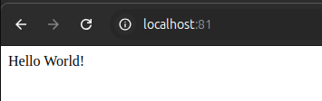

- Положим файл *nginx.conf* по пути *./nginx/nginx.conf* (это понадобится позже).

Использую команду `cp`

## Part 4. Свой докер

Теперь всё готово. Можно приступать к написанию докер-образа для созданного сервера.

**== Задание ==**

*При написании докер-образа избегай множественных вызовов команд RUN*

#### Напиши свой докер-образ, который:
##### 1) собирает исходники мини сервера на FastCgi из [Части 3](#part-3-мини-веб-сервер);
##### 2) запускает его на 8080 порту;
##### 3) копирует внутрь образа написанный *./nginx/nginx.conf*;
##### 4) запускает **nginx**.
_**nginx** можно установить внутрь докера самостоятельно, а можно воспользоваться готовым образом с **nginx**'ом, как базовым._

##### Собери написанный докер-образ через `docker build` при этом указав имя и тег.
##### Проверь через `docker images`, что все собралось корректно.
##### Запусти собранный докер-образ с маппингом 81 порта на 80 на локальной машине и маппингом папки *./nginx* внутрь контейнера по адресу, где лежат конфигурационные файлы **nginx**'а (см. [Часть 2](#part-2-операции-с-контейнером)).
##### Проверь, что по localhost:80 доступна страничка написанного мини сервера.
##### Допиши в *./nginx/nginx.conf* проксирование странички */status*, по которой надо отдавать статус сервера **nginx**.
##### Перезапусти докер-образ.
*Если всё сделано верно, то, после сохранения файла и перезапуска контейнера, конфигурационный файл внутри докер-образа должен обновиться самостоятельно без лишних действий*.
##### Проверь, что теперь по *localhost:80/status* отдается страничка со статусом **nginx**

## Выполнение 

- Напишим свой докер-образ, в который поместим наш FastCgi мини сервер и запускает nginx с скопированным nginx конфигом.

Напишем свой `Dockerfile` в который поместим следующий код:

```dockerfile
# Используем базовый образ nginx
FROM nginx:latest

# Устанавливаем необходимые пакеты
RUN apt-get update && apt-get install -y \
    spawn-fcgi \
    libfcgi-dev \
    gcc

# Копируем исходники мини-сервера
COPY server/hello.c /server/hello.c

# Компилируем исходники
RUN gcc -o /server/hello /server/hello.c -lfcgi

# Копируем конфигурационный файл Nginx
COPY server/nginx/nginx.conf /etc/nginx/nginx.conf

# Команды для запуска мини-сервера и Nginx на порту 8080
CMD ["sh", "-c", "spawn-fcgi -p 8080 /server/hello && nginx -g 'daemon off;'"]

```
- запустим build docker образа с помощью команду `sudo docker build -t my_nginx .`

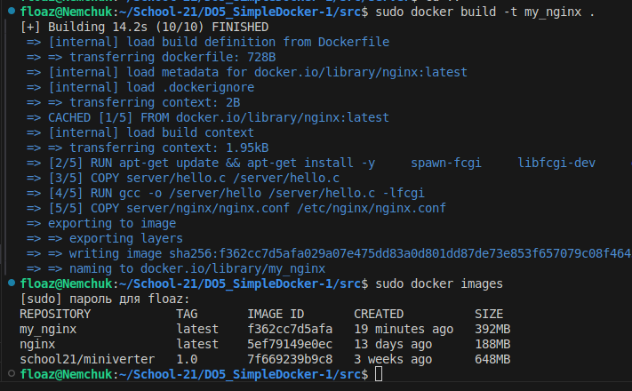

- Запусти собранный докер-образ с маппингом 81 порта на 80 на локальной машине и маппингом папки *./nginx* внутрь контейнера по адресу, где лежат конфигурационные файлы **nginx**

Используем команду `docker run --name mnginx -d -p 80:81 -v $(pwd)/server/nginx/nginx.conf:/etc/nginx/nginx.conf my_nginx`

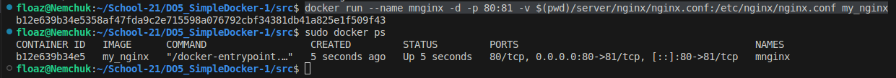

localhost выводит по 80 порту наш hello world


- Допишем в *./nginx/nginx.conf* проксирование странички */status*, по которой надо отдавать статус сервера **nginx**.

```dockerfile

```

- Удалим и перезапустим docker контейнер

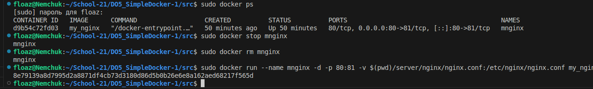

- Проверь, что теперь по *localhost:80/status* отдается страничка со статусом **nginx**

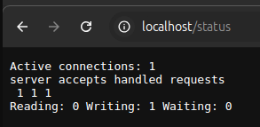

## Part 5. **Dockle**

После написания образа никогда не будет лишним проверить его на безопасность.

**== Задание ==**

##### Просканируй образ из предыдущего задания через `dockle [image_id|repository]`.
##### Исправь образ так, чтобы при проверке через **dockle** не было ошибок и предупреждений.

## Выполнение.

- Просканируем образ из предыдущего задания через `dockle [image_id|repository]`.


Необходимо поставить dockle для этого я зашел на репозиторий [rep dockle](https://github.com/goodwithtech/dockle/releases) и скачал образ.

Устанавливаем с помощью команды `sudo dpkg -i dockle_0.4.14_Linux-64bit.deb`

Используем команду `sudo dockle -ak NGINX_GPGKEY my_nginx:v1` для проверки ошибок.

- Исправим образ так, чтобы при проверке через **dockle** не было ошибок и предупреждений.

внесем изменения в dockerfile

```dockerfile
FROM nginx:1.19.7


RUN apt-get update && apt-get install -y \
    spawn-fcgi \
    libfcgi-dev \
    gcc && rm -rf /var/lib/apt/lists/* \
    && touch /var/run/nginx.pid \
    && chown -R nginx:nginx /var/run/nginx.pid \
    && chown -R nginx:nginx /etc/nginx/nginx.conf \
    && chown -R nginx:nginx /var/cache/nginx \
    && chown -R nginx:nginx /home \
    && chmod u-s /usr/bin/gpasswd \
    && chmod u-s /usr/bin/newgrp \
    && chmod u-s /bin/su \
    && chmod u-s /bin/mount \
    && chmod u-s /bin/umount \
    && chmod u-s /usr/bin/chsh \
    && chmod u-s /usr/bin/chfn \
    && chmod g-s /usr/bin/expiry \
    && chmod g-s /usr/bin/wall \
    && chmod g-s /sbin/unix_chkpwd \
    && chmod g-s /usr/bin/chage \
    && chmod u-s /usr/bin/passwd

COPY server/hello.c /server/hello.c
RUN gcc -o /server/hello /server/hello.c -lfcgi


USER nginx


COPY server/nginx/nginx.conf /etc/nginx/nginx.conf


HEALTHCHECK --interval=30s --timeout=3s CMD curl -f http://localhost/ || exit 1

CMD ["sh", "-c", "spawn-fcgi -p 8080 /server/hello && nginx -g 'daemon off;'"]

```

Запустим команду `export DOCKER_CONTENT_TRUST=1` затем сбилдим образ командой `sudo docker build -t my_nginx:v1 .` и запустим `sudo dockle -ak NGINX_GPGKEY my_nginx:v1`


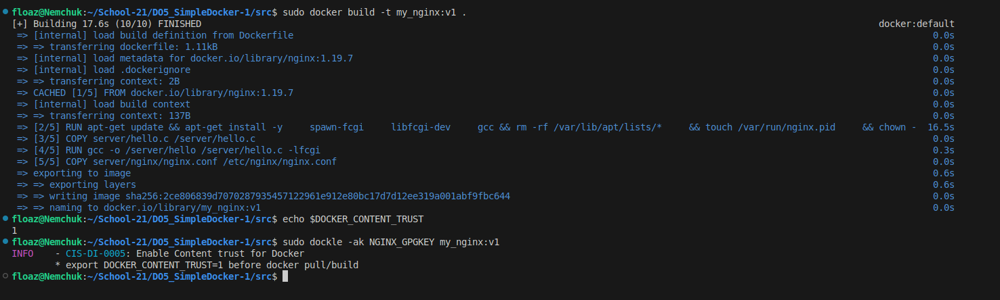

## Part 6. Базовый **Docker Compose**

Вот ты и закончил свою разминку. А хотя погоди...
Почему бы не поэкспериментировать с развёртыванием проекта, состоящего сразу из нескольких докер-образов?

**== Задание ==**

##### Напиши файл *docker-compose.yml*, с помощью которого:
##### 1) Подними докер-контейнер из [Части 5](#part-5-инструмент-dockle) _(он должен работать в локальной сети, т. е. не нужно использовать инструкцию **EXPOSE** и мапить порты на локальную машину)_.
##### 2) Подними докер-контейнер с **nginx**, который будет проксировать все запросы с 8080 порта на 81 порт первого контейнера.
##### Замапь 8080 порт второго контейнера на 80 порт локальной машины.

##### Останови все запущенные контейнеры.
##### Собери и запусти проект с помощью команд `docker-compose build` и `docker-compose up`.
##### Проверь, что в браузере по *localhost:80* отдается написанная тобой страничка, как и ранее.
