# Сети в Linux

## Chapter III

В качестве результата работы ты должен представить отчет по выполненным задачам. В каждой части задания указано, что должно быть помещено в отчёт после её выполнения. Это могут быть ответы на вопросы, скриншоты и т. д.
- В репозиторий, в папку src, должен быть загружен отчёт с расширением .md.
- В отчёте должны быть выделены все части задания как заголовки 2-го уровня.
- В рамках одной части задания всё, что помещается в отчёт, должно быть оформлено в виде списка.
- Каждый скриншот в отчёте должен быть кратко подписан (что показано на скриншоте).
- Все скриншоты обрезаны так, чтобы была видна только нужная часть экрана.
- На одном скриншоте допускается отображение сразу нескольких пунктов задания, но они все должны быть описаны в подписи к скриншоту.
- На все виртуальные машины, созданные в процессе выполнения задания, устанавливай **Ubuntu 20.04 Server LTS**.

Список утилит: `ipcalc`, `ip`, `netplan`, `netstat`, `iperf3`, `iptables`, `ping`, `nmap`, `sysctl`, `tcpdump`, `traceroute`, `systemctl`, `telnet`, `dhclient`.

## Задание №1. Инструмент **ipcalc**

### Подними виртуальную машину (далее -- ws1)

### 1.1. Сети и маски

### Определи и запиши в отчёт:
- Адрес сети *192.167.38.54/13*
- Перевод маски *255.255.255.0* в префиксную и двоичную запись, */15* в обычную и двоичную, *11111111.11111111.11111111.11110000* в обычную и префиксную
- Минимальный и максимальный хост в сети *12.167.38.4* при масках: */8*, *11111111.11111111.00000000.00000000*, *255.255.254.0* и */4*

### 1.2. localhost

Определи и запиши в отчёт, можно ли обратиться к приложению, работающему на localhost, со следующими IP: *194.34.23.100*, *127.0.0.2*, *127.1.0.1*, *128.0.0.1*

#### 1.3. Диапазоны и сегменты сетей
### Определи и запиши в отчёт:
- Какие из перечисленных IP можно использовать в качестве публичного, а какие только в качестве частных: *10.0.0.45*, *134.43.0.2*, *192.168.4.2*, *172.20.250.4*, *172.0.2.1*, *192.172.0.1*, *172.68.0.2*, *172.16.255.255*, *10.10.10.10*, *192.169.168.1*
- Какие из перечисленных IP-адресов шлюза возможны у сети *10.10.0.0/18*: *10.0.0.1*, *10.10.0.2*, *10.10.10.10*, *10.10.100.1*, *10.10.1.255*


## Выполнение задания.

## 1.1 *ipcalc* 

1. Установим утилиту ipcalc командой `sudo apt install ipcalc`
    
    - Введем команду `ipcalc 192.167.38.54/13` Напротив address получаем двоичную запись. префиксная часть \13 это netmask тоесть 13 еденичек слева направо получаем 255.248.0.0 в десятичной и напротив в двоичной.

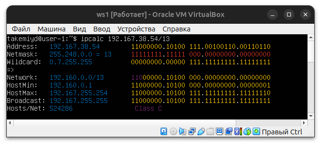

2. Перевод маски в префиксную и двоичную
    - Введем команду `ipcalc 0 255.255.255.0`  Напротив netmask увидим /24 это потому что в двоичной системе будет 24 еденички и дальше видим сам двоичный код маски.

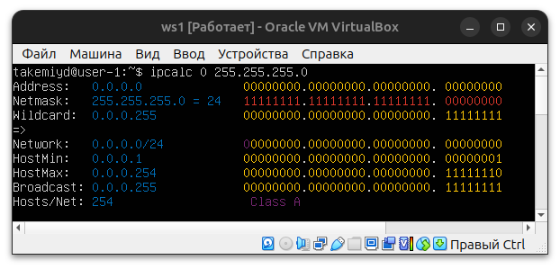

3. Перевод префикса в двоичную и десятичную
    - Введем команду `ipcalc 0 /15` Напротив netmask увидим десятичное представление 255.254.0.0 и напротив двоичное представление.


4. Перевод двоичного *11111111.11111111.11111111.11110000* в обычную и префиксную
    - Переводим из двоичной в префиксную и получаем 28 вводим команду `ipcalc 0 /28` получаем 255.255.255.240 = 28

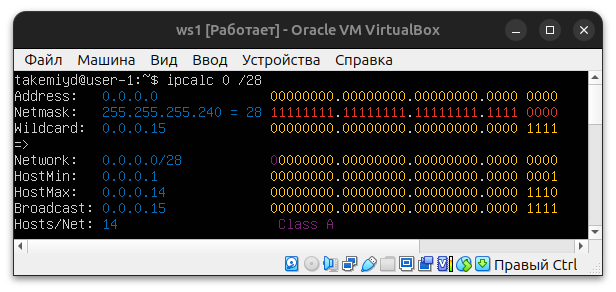

5. Минимальный и максимальный хост в сети *12.167.38.4* при маски /8 получаем 16777214 айпишников для выдачи
    - Введем команду `ipcalc 12.167.38.4/8` 

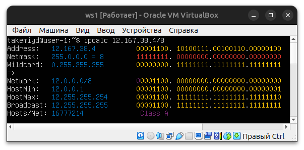

6. Минимальный и максимальный хост в сети при маски *11111111.11111111.00000000.00000000*
    - Переведем маску в префиксную форму и получим /16 введем команду `ipcalc 12.167.38.4/16` получаем 65534 айпишинка для выдачи.


7. Минимальный и максимальный хост в сети при маски *255.255.254.0*
    - Переведем маску в префиксную форму и получим /23 введем команду `ipcalc 12.167.38.4/23` получаем 510 айпишников для выдачи.

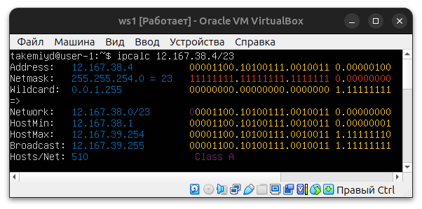

8. Минимальный и максимальный хост в сети при маски */4*
    -  Введем команду `ipcalc 12.167.38.4/4` получаем 268435454 айпишников.

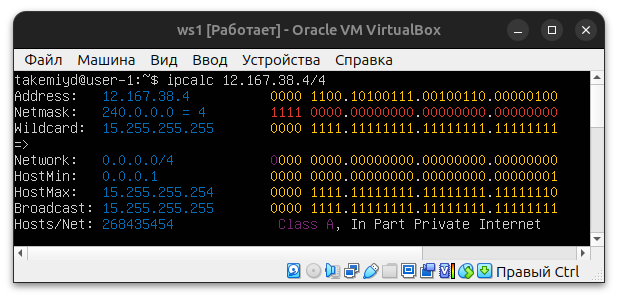

## 1.2. localhost

localhost — это зарезервированное доменное имя, которое ссылается на IP-адрес _127.0.0.1_ по умолчанию. Оно используется для обращения к локальной машине, то есть к самому себе.
_127.0.0.0/8_ — это диапазон адресов, зарезервированный для обратной петли (loopback). Любой IP-адрес из этого диапазона будет направлен на локальный хост.
Маска _/8_ в двоичном представлении будет выглядеть так _255.0.0.0_ это означает что _255(127)_ зарезервировано для обращение к самому себе а нули которые могут быть в диапазоне от 0 до 255 для обращения к хостам внутри сети.
Это означает что диапазон IP к которым можно будет обратиться будет выглядеть следующим образом `min 127.0.0.1` до `max 127.255.255.255`

- *194.34.23.100* - выходит за резервированный диапазон
- *127.0.0.2* - входит в диапазон
- *127.1.0.1* - входит в диапазон
- *128.0.0.1* - выходит за резервированный диапазон
 

## 1.3. Диапазоны и сегменты сетей

1. Диапазоны и сегменты сетей

IP-адреса в сети можно разделить на публичные и частные. Публичные IP-адреса используются для доступа к интернету, и они уникальны в глобальном масштабе, тогда как частные IP-адреса используются для внутренних сетей и не выходят за пределы локальной сети.
Определение публичных и частных IP-адресов

Частные IP-адреса определены следующими диапазонами:

- 10.0.0.0 — 10.255.255.255 (маска /8)
- 172.16.0.0 — 172.31.255.255 (маска /12)
- 192.168.0.0 — 192.168.255.255 (маска /16)

Эти диапазоны используются для частных сетей и не могут быть использованы в качестве публичных IP-адресов.

Проверим наши IP адреса.

- 10.0.0.45 - Частный IP, так как попадает в диапазон 10.0.0.0/8.
- 134.43.0.2 - Публичный IP, так как не попадает ни в один из частных диапазонов.
- 192.168.4.2 - Частный IP, так как попадает в диапазон 192.168.0.0/16.
- 172.20.250.4 - Частный IP, так как попадает в диапазон 172.16.0.0/12.
- 172.0.2.1 - Публичный IP, так как не попадает в диапазон 172.16.0.0/12.
- 192.172.0.1 - Публичный IP, так как не попадает ни в один из частных диапазонов.
- 172.68.0.2 - Публичный IP, так как не попадает в диапазон 172.16.0.0/12.
- 172.16.255.255 - Частный IP, так как попадает в диапазон 172.16.0.0/12.
- 10.10.10.10 - Частный IP, так как попадает в диапазон 10.0.0.0/8.
- 192.169.168.1 - Публичный IP, так как не попадает ни в один из частных диапазонов.

2. Определение возможных IP-адресов шлюза для сети 10.10.0.0/18

Диапазон IP-адресов для сети 10.10.0.0/18:

- Минимальный адрес: 10.10.0.1 (первый адрес для хоста, после адреса сети).
- Максимальный адрес: 10.10.63.254 (последний адрес для хоста, до адреса broadcast).

Проверим наши IP адреса.

- 10.0.0.1 - Не входит в диапазон сети 10.10.0.0/18.
- 10.10.0.2 - Входит в диапазон и может быть адресом шлюза.
- 10.10.10.10 - Входит в диапазон и может быть адресом шлюза.
- 10.10.100.1 - Не входит в диапазон сети 10.10.0.0/18.
- 10.10.1.255 - Входит в диапазон и может быть адресом шлюза.

## Part 2. Статическая маршрутизация между двумя машинами

### Подними две виртуальные машины (далее -- ws1 и ws2).

### С помощью команды `ip a` посмотри существующие сетевые интерфейсы.
- В отчёт помести скрин с вызовом и выводом использованной команды.
### Опиши сетевой интерфейс, соответствующий внутренней сети, на обеих машинах и задай следующие адреса и маски: ws1 — *192.168.100.10*, маска */16*, ws2 — *172.24.116.8*, маска */12*.
- В отчёт помести скрины с содержанием изменённого файла *etc/netplan/00-installer-config.yaml* для каждой машины.
### Выполни команду `netplan apply` для перезапуска сервиса сети.
- В отчёт помести скрин с вызовом и выводом использованной команды.

### 2.1. Добавление статического маршрута вручную
### Добавь статический маршрут от одной машины до другой и обратно при помощи команды вида `ip r add`.
### Пропингуй соединение между машинами.
- В отчёт помести скрин с вызовом и выводом использованных команд.

### 2.2. Добавление статического маршрута с сохранением
### Перезапусти машины.
### Добавь статический маршрут от одной машины до другой с помощью файла */etc/netplan/00-installer-config.yaml*.
- В отчёт помести скрин с содержанием изменённого файла */etc/netplan/00-installer-config.yaml*.
### Пропингуй соединение между машинами.
- В отчёт помести скрин с вызовом и выводом использованной команды.

## Выполнение.

Переключаем сетевой режим (Сеть) с NAT на Внутреннюю сеть в VirtualBox.

1. С помощью команды `ip a` посмотрим существующие сетевые интерфейсы для обеих машин.
- Для ws1

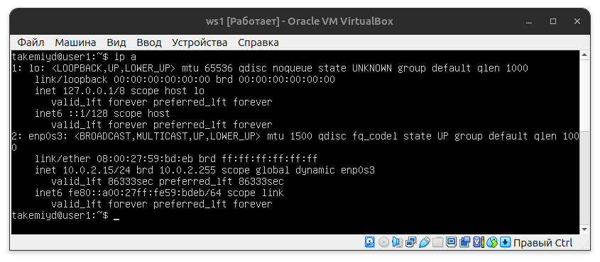

- Для ws2


2. Зададим следующие адреса и маски: ws1 — *192.168.100.10*, маска */16*, ws2 — *172.24.116.8*, маска */12*.

- Ws1 

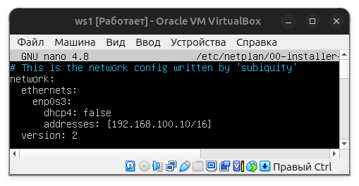

- Ws2

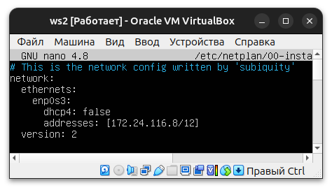

3. Выполним команду `netplan apply` для перезапуска сервиса сети.

- Ws1


- Ws2

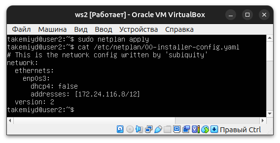

4. Добавление статического маршрута вручную

Команда `ip route add` позволяет добавлять, изменять или удалять маршруты вручную в таблице маршрутизации. Эти изменения применяются немедленно и остаются в силе до следующей перезагрузки системы или до тех пор, пока не будут изменены другими командами или настройками.
Использование `ip route add` позволяет временно переопределить маршруты или добавлять маршруты для определённых случаев, таких как тестирование или временные решения.

5. Добавим статический маршрут от одной машины до другой и обратно при помощи команды вида `ip r add`
    
- ws 1 `sudo ip r add 172.24.116.8 dev enp0s3` добавляем маршрут до другой машины.

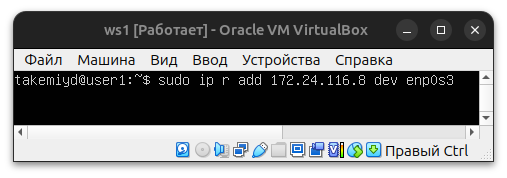

- ws 2 `sudo ip r add 192.168.100.10 dev enp0s3` добавляем маршрут до другой машины.

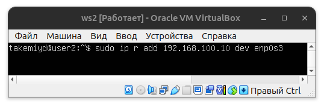
 
6. Пропингуем соединение между машинами.

- ws 1 `ping -c 3 172.24.116.8`

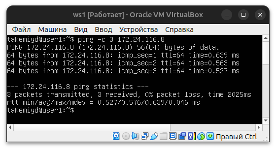

- ws 2 `ping -c 3 192.168.100.10`

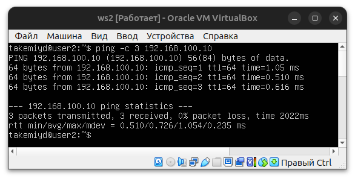

7. Пропишем статический маршрут в netplan config.

- ws 1 `sudo nano */etc/netplan/00-installer-config.yaml*.`

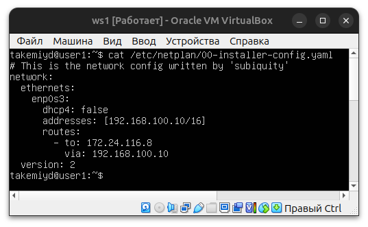

`sudo netplan apply`

- ws 2 `sudo nano */etc/netplan/00-installer-config.yaml*.`

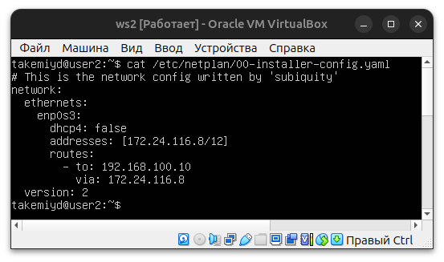

`sudo netplan apply`

- пингуем машину ws 2 `ping -c 3 172.24.116.8`


- пингуем машину ws 1 `ping -c 3 192.168.100.10`

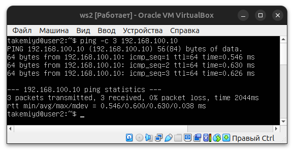

## Part 3. Утилита **iperf3**

#### 3.1. Скорость соединения
##### Переведи и запиши в отчёт: 8 Mbps в MB/s, 100 MB/s в Kbps, 1 Gbps в Mbps.

#### 3.2. Утилита **iperf3**
##### Измерь скорость соединения между ws1 и ws2.
- В отчёт помести скрины с вызовом и выводом использованных команд.

## Выполнение. 

### 1. Переведем скорость соединения.

8 Mbps в MB/s:

    Mbps (Мегабит в секунду) — это миллионы бит в секунду.
    MB/s (Мегабайт в секунду) — это миллионы байт в секунду.
    1 байт = 8 бит.

Перевод:

    8 Mbps = 8 Mbps / 8 = 1 MB/s

100 MB/s в Kbps:

    MB/s (Мегабайт в секунду) — это миллионы байт в секунду.
    Kbps (Килобит в секунду) — это тысячи бит в секунду.
    1 байт = 8 бит.
    1 МБ = 1000 КБ (в системе измерения данных).

Перевод:

    100 MB/s=100×8×1000=800,000 Kbps


1 Gbps в Mbps:

    Gbps (Гигабит в секунду) — это миллиарды бит в секунду.
    Mbps (Мегабит в секунду) — это миллионы бит в секунду.
    1 Гб = 1000 Мб.

Перевод:

    1 Gbps= 1000 Mbps

### 2. Измерим скорость соединения между ws1 и ws2.

На обеих машинах (ws1 и ws2) выполните команду для установки утилиты iperf3:

- `sudo apt-get install iperf3` важно, если сетевой режим (Сеть) в режиме внутренняя сеть в VirtualBox то необходимо переключить в NAT.

На машине ws1 запустили iperf3 в режиме сервера:

- `iperf3 -s` и ожидаем коннекта от другой машины

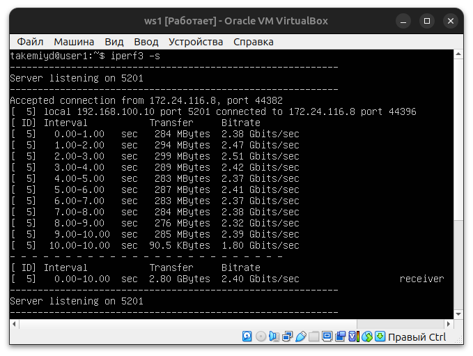

На машине ws2 пингуем наш сервер на машине ws1

- `iperf3 -c 192.168.100.10`

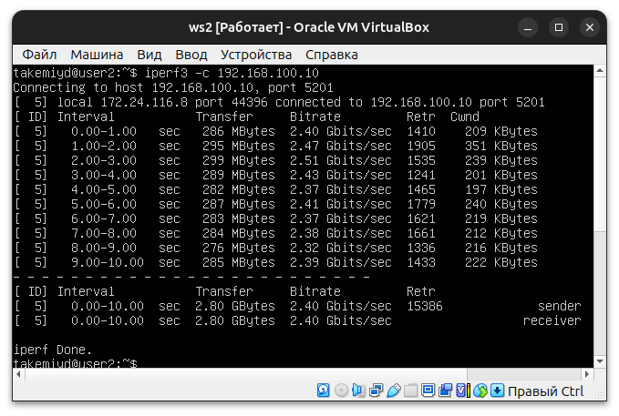

## Part 4. Сетевой экран

#### 4.1. Утилита **iptables**
##### Создай файл */etc/firewall.sh*, имитирующий файрвол, на ws1 и ws2:
```shell
#!/bin/sh

# Удаление всех правил в таблице «filter» (по умолчанию).
iptables -F
iptables -X
```
##### Нужно добавить в файл подряд следующие правила:
##### 1) На ws1 примени стратегию, когда в начале пишется запрещающее правило, а в конце пишется разрешающее правило (это касается пунктов 4 и 5).
##### 2) На ws2 примени стратегию, когда в начале пишется разрешающее правило, а в конце пишется запрещающее правило (это касается пунктов 4 и 5).
##### 3) Открой на машинах доступ для порта 22 (ssh) и порта 80 (http).
##### 4) Запрети *echo reply* (машина не должна «пинговаться», т. е. должна быть блокировка на OUTPUT).
##### 5) Разреши *echo reply* (машина должна «пинговаться»).
- В отчёт помести скрины с содержанием файла */etc/firewall* для каждой машины.
##### Запусти файлы на обеих машинах командами `chmod +x /etc/firewall.sh` и `/etc/firewall.sh`.
- В отчёт помести скрины с запуском обоих файлов.
- В отчёте опиши разницу между стратегиями, применёнными в первом и втором файлах.

#### 4.2. Утилита **nmap**
##### Командой **ping** найди машину, которая не «пингуется», после чего утилитой **nmap** покажи, что хост машины запущен.
*Проверка: в выводе nmap должно быть сказано: `Host is up`*.
- В отчёт помести скрины с вызовом и выводом использованных команд **ping** и **nmap**.

##### Сохрани дампы образов виртуальных машин
**P.S. Ни в коем случае не сохраняй дампы в гит!**

## Выполнение 

## Введение в Iptables
Iptables работает путем проверки пакетов данных на соответствие определенным критериям и выполнения заданных действий, если пакеты соответствуют этим критериям. Эти критерии и действия определяются в таблицах, которые состоят из набора правил.

В Iptables есть четыре основные таблицы:

1. Filter - это основная таблица, используемая для фильтрации пакетов.

2. NAT - эта таблица используется для настройки NAT (Network Address Translation).

3. Mangle - эта таблица используется для специальной обработки пакетов.

4. Raw - эта таблица используется для обхода системы отслеживания состояний.

Каждая таблица состоит из набора цепочек. Цепочки - это последовательности правил, которые применяются к пакетам. В Iptables есть три встроенные цепочки:

- INPUT - эта цепочка применяется к пакетам, которые предназначены для самой системы.

- FORWARD - эта цепочка применяется к пакетам, которые проходят через систему.

- OUTPUT - эта цепочка применяется к пакетам, которые исходят из системы.

`iptables -t <таблица> <команда> <цепочка> [номер] <условие> <действие>`

### Откроем доступ на машинах для порта 22 (ssh) и 80 (http)

Чтобы открыть порт для входящего трафика, используем следующую команду:

`iptables -A INPUT -p tcp --dport 80 -j ACCEPT` 

В этой команде -p tcp указывает на протокол (в данном случае TCP), --dport 80 указывает на порт (в данном случае 80), а -j ACCEPT указывает, что все пакеты, соответствующие этому правилу, должны быть приняты.

Аналогично 80 сделать для 22

`iptables -A INPUT -p tcp --dport 22 -j ACCEPT`

### Добавим два правила для отправки пакетов

1. `iptables -A OUTPUT -p icmp --icmp-type echo-reply -j ACCEPT`

    - -A OUTPUT: Это указывает, что правило добавляется (-A, что означает "append", т.е. добавить) в цепочку OUTPUT. Цепочка OUTPUT управляет исходящими пакетами, то есть теми, которые отправляются с вашего компьютера на другой.

    - -p icmp: Этот флаг указывает протокол, к которому применяется правило. В данном случае, это ICMP (Internet Control Message Protocol), который используется, например, для команд ping.

    - --icmp-type echo-reply: Здесь указывается конкретный тип ICMP-пакета. echo-reply — это ответ на запрос ping (когда другой хост отвечает на ваш ping).

    - -j ACCEPT: Это действие, которое будет выполнено, если пакет соответствует всем предыдущим условиям. ACCEPT означает, что пакет будет принят и отправлен дальше.

Итог: Эта команда добавляет правило, разрешающее отправку ICMP-пакетов типа echo-reply (ответы на ping) от вашей машины к другим.

2. `iptables -A OUTPUT -p icmp --icmp-type echo-reply -j DROP`

    - -A OUTPUT: Аналогично, это правило добавляется в цепочку OUTPUT, управляющую исходящими пакетами.

    - -p icmp: Опять же, это правило применяется к ICMP-пакетам.

    - --icmp-type echo-reply: Указывает, что правило должно действовать на пакеты типа echo-reply.

    - -j DROP: Это действие, которое указывает, что все пакеты, соответствующие условиям правила, должны быть отброшены (не будут отправлены и дальше не будут обработаны).

Итог: Эта команда добавляет правило, запрещающее отправку ICMP-пакетов типа echo-reply, т.е. машина не будет отвечать на входящие запросы ping.

- Ws1

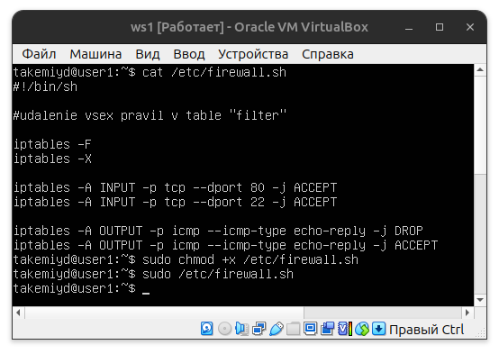

- Ws2

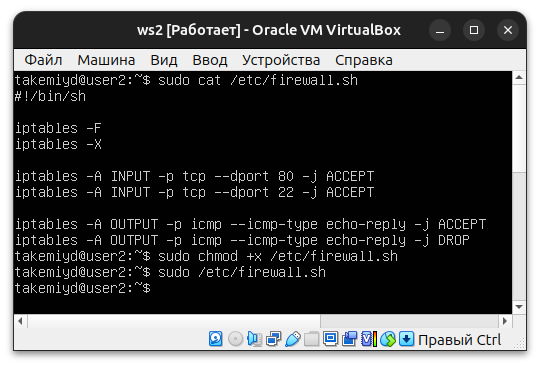

Разница между стратегиями: 
 
- На ws1: 
  - Сначала добавляется запрещающее правило для echo reply, а затем разрешающее правило. 
  - В результате, запрещающее правило применяется первым, и машина не сможет ответить на ping-запросы, так как пакеты echo-reply будут заблокированы. 
 
- На ws2: 
  - Сначала добавляется разрешающее правило для echo reply, а затем запрещающее правило. 
  - В результате, разрешающее правило применяется первым, и машина сможет ответить на ping-запросы, так как пакеты echo-reply будут разрешены.


## Утилита **nmap**

##### Командой **ping** найди машину, которая не «пингуется», после чего утилитой **nmap** покажи, что хост машины запущен.

1. Исходя из скрипта мы понимаем что не будет пинговаться машина номер 1 когда мы будет отправлять запрос с машины номер 2.
    - Используем команду ping `192.168.100.10` и видим что сервак не пингуется.
    - Затем используем команду `nmap 192.168.100.10` чтобы увидеть что наши пакеты доходят но не возвращаются обратно.


## Part 5. Статическая маршрутизация сети

Сеть: \


##### Подними пять виртуальных машин (3 рабочие станции (ws11, ws21, ws22) и 2 роутера (r1, r2)).

#### 5.1. Настройка адресов машин
##### Настрой конфигурации машин в *etc/netplan/00-installer-config.yaml* согласно сети на рисунке.
- В отчёт помести скрины с содержанием файла *etc/netplan/00-installer-config.yaml* для каждой машины.
##### Перезапусти сервис сети. Если ошибок нет, командой `ip -4 a` проверь, что адрес машины задан верно. Также пропингуй ws22 с ws21. Аналогично пропингуй r1 с ws11.
- В отчёт помести скрины с вызовом и выводом использованных команд.

#### 5.2. Включение переадресации IP-адресов
##### Для включения переадресации IP выполни команду на роутерах:
`sysctl -w net.ipv4.ip_forward=1`
*При таком подходе переадресация не будет работать после перезагрузки системы.*
- В отчёт помести скрин с вызовом и выводом использованной команды.
##### Открой файл */etc/sysctl.conf* и добавь в него следующую строку:
`net.ipv4.ip_forward = 1`
*При использовании этого подхода, IP-переадресация включена на постоянной основе.*
- В отчёт помести скрин с содержанием изменённого файла */etc/sysctl.conf*.

#### 5.3. Установка маршрута по умолчанию
Пример вывода команды `ip r` после добавления шлюза:
```
default via 10.10.0.1 dev eth0
10.10.0.0/18 dev eth0 proto kernel scope link src 10.10.0.2
```
##### Настрой маршрут по умолчанию (шлюз) для рабочих станций. Для этого добавь `default` перед IP-роутера в файле конфигураций.
- В отчёт помести скрин с содержанием файла *etc/netplan/00-installer-config.yaml*;
##### Вызови `ip r` и покажи, что добавился маршрут в таблицу маршрутизации.
- В отчёт помести скрин с вызовом и выводом использованной команды.
##### Пропингуй с ws11 роутер r2 и покажи на r2, что пинг доходит. Для этого используй команду:
`tcpdump -tn -i eth0`
- В отчёт помести скрин с вызовом и выводом использованных команд.

#### 5.4. Добавление статических маршрутов
##### Добавь в роутеры r1 и r2 статические маршруты в файле конфигураций. Пример для r1 маршрута в сетку 10.20.0.0/26:
```shell
# Добавь в конец описания сетевого интерфейса eth1:
- to: 10.20.0.0
  via: 10.100.0.12
```
- В отчёт помести скрины с содержанием изменённого файла *etc/netplan/00-installer-config.yaml* для каждого роутера.
##### Вызови `ip r` и покажи таблицы с маршрутами на обоих роутерах. Пример таблицы на r1:
```
10.100.0.0/16 dev eth1 proto kernel scope link src 10.100.0.11
10.20.0.0/26 via 10.100.0.12 dev eth1
10.10.0.0/18 dev eth0 proto kernel scope link src 10.10.0.1
```
- В отчёт помести скрин с вызовом и выводом использованной команды.
##### Запусти команды на ws11:
`ip r list 10.10.0.0/[маска сети]` и `ip r list 0.0.0.0/0`
- В отчёт помести скрин с вызовом и выводом использованных команд;
- В отчёте объясни, почему для адреса 10.10.0.0/\[маска сети\] был выбран маршрут, отличный от 0.0.0.0/0, хотя он попадает под маршрут по умолчанию.

#### 5.5. Построение списка маршрутизаторов
Пример вывода утилиты **traceroute** после добавления шлюза:
```
1 10.10.0.1 0 ms 1 ms 0 ms
2 10.100.0.12 1 ms 0 ms 1 ms
3 10.20.0.10 12 ms 1 ms 3 ms
```
##### Запусти на r1 команду дампа:
`tcpdump -tnv -i eth0`
##### При помощи утилиты **traceroute** построй список маршрутизаторов на пути от ws11 до ws21.
- В отчёт помести скрины с вызовом и выводом использованных команд (tcpdump и traceroute);
- В отчёте, опираясь на вывод, полученный из дампа на r1, объясни принцип работы построения пути при помощи **traceroute**.

#### 5.6. Использование протокола **ICMP** при маршрутизации
##### Запусти на r1 перехват сетевого трафика, проходящего через eth0 с помощью команды:
`tcpdump -n -i eth0 icmp`
##### Пропингуй с ws11 несуществующий IP (например, *10.30.0.111*) с помощью команды:
`ping -c 1 10.30.0.111`
- В отчёт помести скрин с вызовом и выводом использованных команд.

##### Сохрани дампы образов виртуальных машин.
**P.S. Ни в коем случае не сохраняй дампы в гит!**

## Выполнение

### Настройка адресов машин


- Создаем в virtualbox машины и настраиваем их по такому принципу 

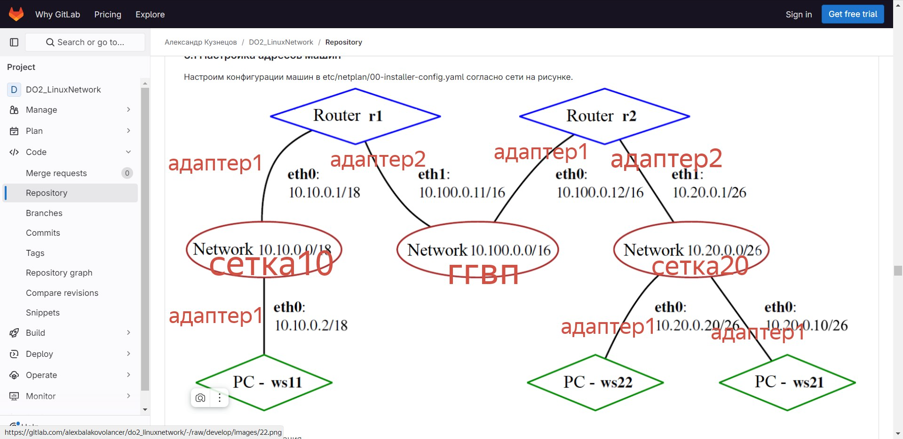

#### Настрой конфигурации машин в *etc/netplan/00-installer-config.yaml* согласно сети на рисунке.

- r1 

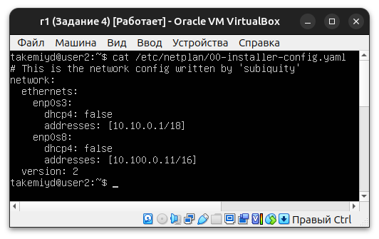

- r2

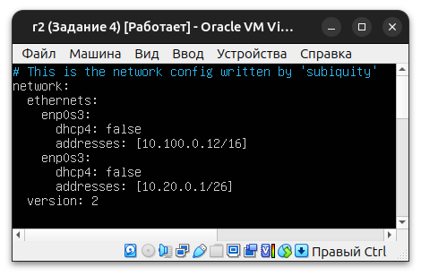

- ws11

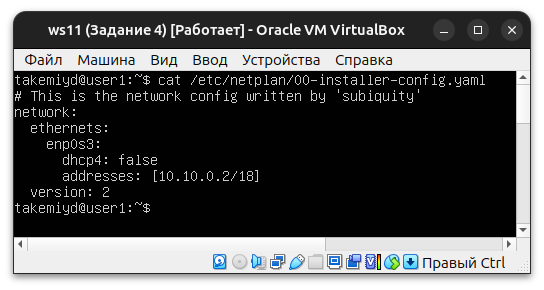

- ws21

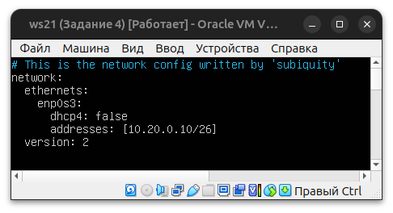

- ws22

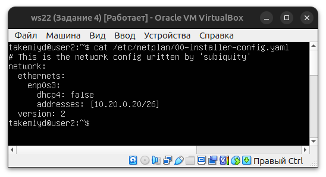

#### Перезапусти сервис сети. Если ошибок нет, командой `ip -4 a` проверь, что адрес машины задан верно. Также пропингуй ws22 с ws21. Аналогично пропингуй r1 с ws11.

- Пингуем r1 с ws11

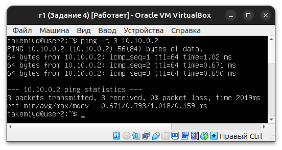

- Пингуем ws22 с ws21

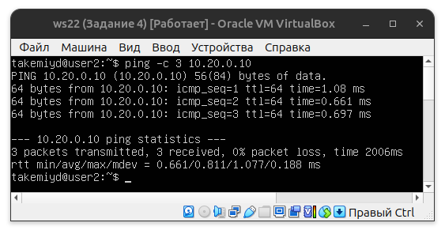


#### Включение переадресации IP-адресов

#### Для включения переадресации IP выполни команду на роутерах:

- `sudo sysctl -w net.ipv4.ip_forward=1`
*При таком подходе переадресация не будет работать после перезагрузки системы.*

- r1

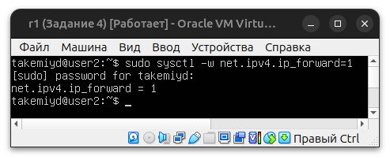

- r2

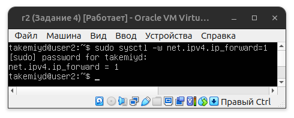

#### Открой файл */etc/sysctl.conf* и добавь в него следующую строку:

*При использовании этого подхода, IP-переадресация включена на постоянной основе.*

- Расскоментируем строчку где указа следующая строка `net.ipv4.ip_forward = 1`

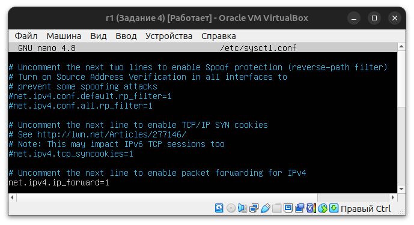

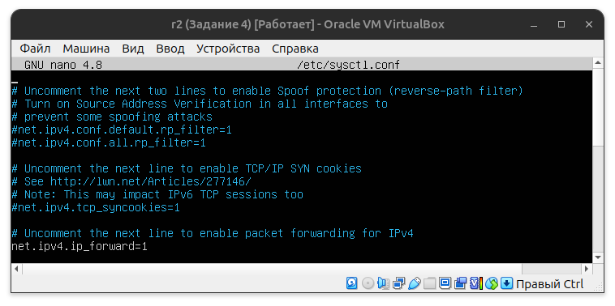


#### 5.3. Установка маршрута по умолчанию

#### Введение 

Шлюз — это сетевое устройство, которое соединяет две или более сети и управляет маршрутизацией трафика между ними. Он работает как посредник, передающий пакеты данных от одной сети к другой. Добавление gateway (шлюза) в конфигурацию сетевого интерфейса делает возможным передачу данных между различными сетями, в которых находятся рабочие станции.

В ситуации, когда у вас есть несколько сетей с разными IP-адресными пространствами, компьютеры в одной сети не смогут напрямую общаться с компьютерами в другой сети без маршрутизации. Чтобы они могли обмениваться данными:

Почему важно добавлять маршрут по умолчанию?

Маршрут по умолчанию (default route) определяет, куда должны направляться все пакеты, для которых не найдено специального маршрута. Обычно это адрес шлюза, который и отвечает за передачу таких пакетов в другие сети.

    Когда вы добавляете маршрут по умолчанию: Вы указываете системе, что если она не знает, куда отправить данные (т.е. для них нет специального маршрута), они должны быть отправлены на указанный шлюз.

Как работает весь процесс?

    Маршрутизация через шлюз: Когда рабочая станция пытается связаться с компьютером, находящимся в другой сети, она отправляет пакеты на указанный шлюз.
    Шлюз перенаправляет пакеты: Шлюз получает эти пакеты и, основываясь на своей таблице маршрутизации, перенаправляет их в целевую сеть.
    Обратная связь: Если нужно, другой компьютер или роутер также должен иметь маршрут обратно к первой рабочей станции, чтобы ответные пакеты могли достичь своего адресата.

Пример использования в вашем случае

    Рабочая станция ws11 имеет IP-адрес 10.10.0.2/18 и шлюз 10.10.0.1.
    Роутер r2 находится в другой сети.
    Когда ws11 захочет послать данные r2, она направит их на 10.10.0.1 (шлюз), который уже передаст их в нужную сеть, где находится r2.

В итоге, этот процесс настраивает связь между различными сетями и позволяет узлам в одной сети взаимодействовать с узлами в другой, используя маршрутизацию через шлюз.

#### Настрой маршрут по умолчанию (шлюз) для рабочих станций. Для этого добавь `default` перед IP-роутера в файле конфигураций.
#### Вызови `ip r` и покажи, что добавился маршрут в таблицу маршрутизации.

Пропишем gateway на все машины.

- r1

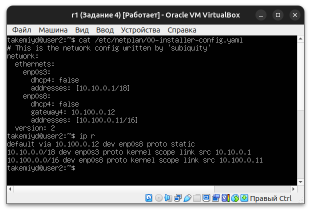

- r2 

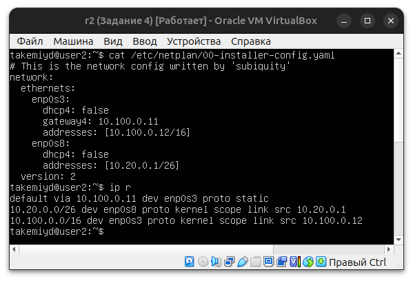

- ws11

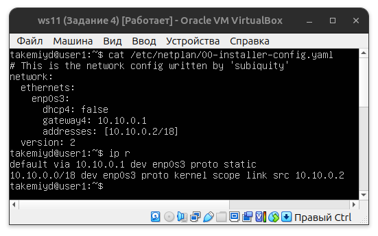

- ws21

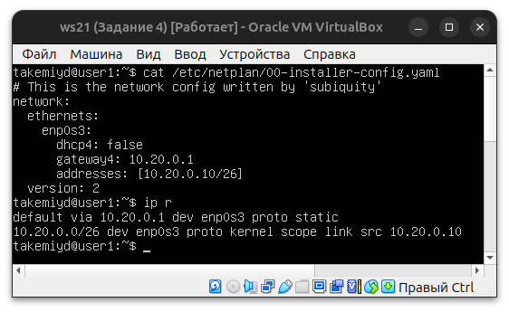

- ws22

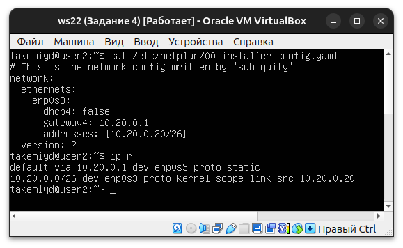

#### Пропингуй с ws11 роутер r2 и покажи на r2, что пинг доходит. Для этого используй команду:


- `tcpdump -tn -i eth0` пингуем наш роутер

-ws11 

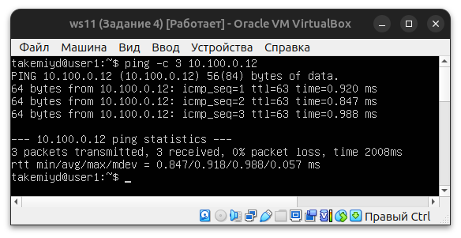

- r2

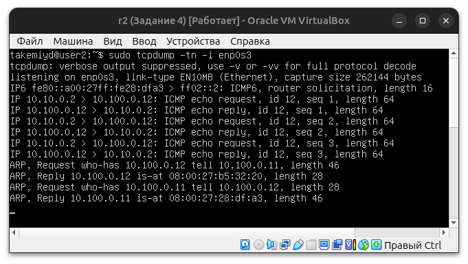

#### 5.4. Добавление статических маршрутов
##### Добавь в роутеры r1 и r2 статические маршруты в файле конфигураций. Пример для r1 маршрута в сетку 10.20.0.0/26:
##### Вызови `ip r` и покажи таблицы с маршрутами на обоих роутерах. Пример таблицы на r1:

- r1

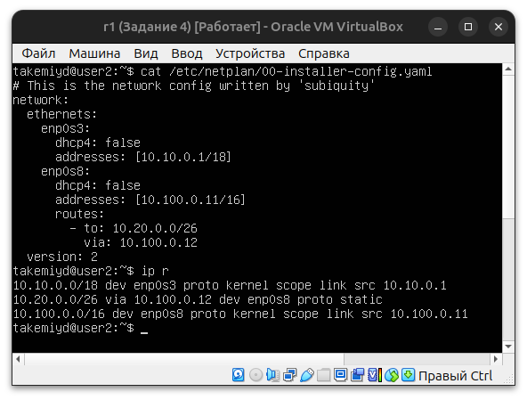

- r2

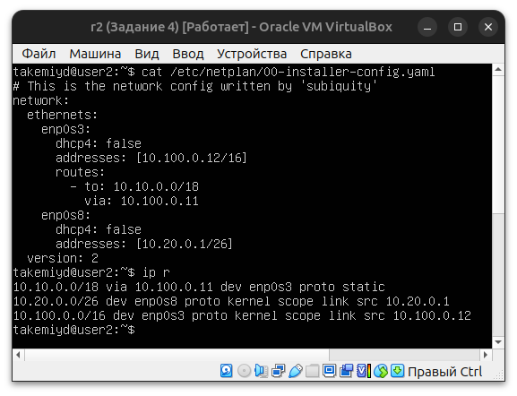

##### Запусти команды на ws11:

- Выполним команды `ip r list 10.10.0.0/[маска сети]` и `ip r list 0.0.0.0/0`


Объяснение выбора маршрута

    Специфический маршрут для сети 10.10.0.0/[маска сети]:
        Этот маршрут указывает, что трафик, адресованный к сети 10.10.0.0 с определенной маской сети, должен направляться через конкретный интерфейс или шлюз.
        Например, запись 10.10.0.0/18 dev eth0 указывает, что весь трафик для подсети 10.10.0.0/18 должен отправляться через интерфейс.

    Маршрут по умолчанию 0.0.0.0/0:
        Маршрут по умолчанию используется для всех IP-адресов, для которых нет более специфического маршрута в таблице.
        Он применим ко всем направлениям, которые не соответствуют более точным записям.

Почему выбран специфический маршрут?

Когда система обрабатывает пакет, она сравнивает IP-адрес назначения с маршрутами в таблице. Если существует маршрут с префиксом, который более специфичен (то есть имеет больше значащих бит), чем маршрут по умолчанию, этот специфический маршрут будет выбран.

#### 5.5. Построение списка маршрутизаторов
##### Запусти на r1 команду дампа:
- запустим команду `tcpdump -tnv -i eth0` на машине r1

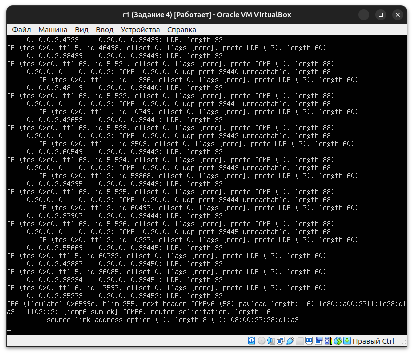

##### При помощи утилиты **traceroute** построй список маршрутизаторов на пути от ws11 до ws21.

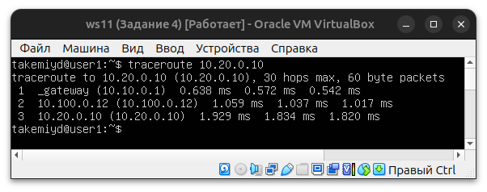

Когда traceroute отправляет пакеты, каждый маршрутизатор, на который попадает пакет, отправляет ICMP сообщение обратно. Это позволяет traceroute понять, через какие устройства проходит пакет.

    Дамп на r1: Когда мы используем tcpdump на r1, вы увидим эти ICMP-сообщения, поступающие от маршрутизаторов, участвующих в маршрутизации, когда traceroute пытается достичь ws21. Это наглядно показывает, как traceroute строит маршрут до целевого узла.


#### 5.6. Использование протокола **ICMP** при маршрутизации
##### Запусти на r1 перехват сетевого трафика, проходящего через eth0 с помощью команды:

- Используем команду на r1 `tcpdump -n -i eth0 icmp`

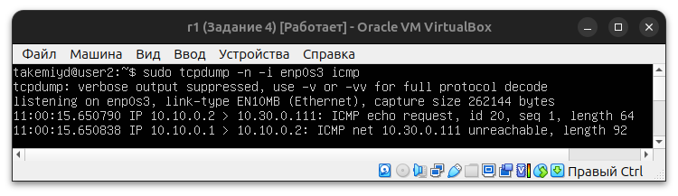

##### Пропингуй с ws11 несуществующий IP (например, *10.30.0.111*) с помощью команды:

- используем команду  `ping -c 1 10.30.0.111` на машине ws 11 

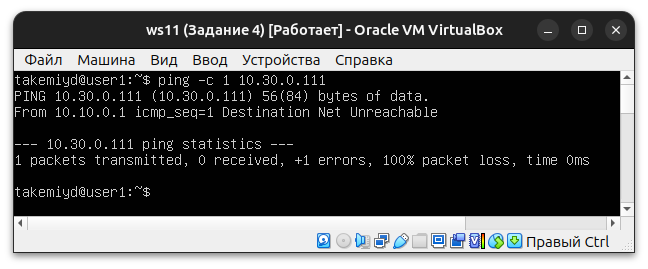


##### Сохрани дампы образов виртуальных машин.
**P.S. Ни в коем случае не сохраняй дампы в гит!**


## Part 6. Динамическая настройка IP с помощью **DHCP**

##### Для r2 настрой в файле */etc/dhcp/dhcpd.conf* конфигурацию службы **DHCP**:

##### Определение внутренней сети (например, 10.100.0.0/16)
subnet 10.100.0.0 netmask 255.255.0.0 {}

##### Определение сети для клиентов (например, 10.20.0.0/26)
subnet 10.20.0.0 netmask 255.255.255.192
{
    # Диапазон IP-адресов, который будет выдаваться клиентам
    range 10.20.0.2 10.20.0.50;

    # Маршрутизатор по умолчанию (gateway), который будет назначен клиентам
    option routers 10.20.0.1;

    # DNS-сервер, который будет назначен клиентам
    option domain-name-servers 10.20.0.1;
}

Пояснение:

    subnet 10.100.0.0 netmask 255.255.0.0 {}:
        Это определение внутренней сети, в которой находится маршрутизатор r2. В данном случае указана сеть 10.100.0.0 с маской 255.255.0.0 (то есть сеть /16). Это указание, что DHCP-сервер работает на этой сети, но в этом блоке конфигурации не выделяется диапазон IP-адресов для раздачи.

    subnet 10.20.0.0 netmask 255.255.255.192:
        Здесь определяется другая сеть, 10.20.0.0/26, для которой будет настроен DHCP. Маска подсети 255.255.255.192 (или /26) означает, что в этой подсети 64 адреса, из которых 62 могут быть выданы клиентам (два адреса зарезервированы: один для сети и один для широковещательного сообщения).

    range 10.20.0.2 10.20.0.50:
        Это диапазон IP-адресов, которые будут назначаться клиентам DHCP в сети 10.20.0.0/26. В данном случае диапазон от 10.20.0.2 до 10.20.0.50.

    option routers 10.20.0.1:
        Указывает IP-адрес маршрутизатора по умолчанию (gateway), который будет назначен клиентам. Это тот адрес, который клиенты будут использовать для отправки пакетов за пределы своей локальной сети.

    option domain-name-servers 10.20.0.1:
        Указывает IP-адрес DNS-сервера, который будет использоваться клиентами для разрешения доменных имен. В этом примере DNS-сервер имеет тот же адрес, что и маршрутизатор.

Итог:

Этот конфигурационный файл DHCP сервера настроен так, чтобы выдавать клиентам в сети 10.20.0.0/26 IP-адреса из указанного диапазона, а также назначать им маршрутизатор по умолчанию и DNS-сервер. Это позволяет устройствам в этой сети автоматически получать настройки IP, необходимые для подключения к сети и доступа к интернету или другим сетям.


##### 1) Укажи адрес маршрутизатора по умолчанию, DNS-сервер и адрес внутренней сети.
##### 2) В файле *resolv.conf* пропиши `nameserver 8.8.8.8`.


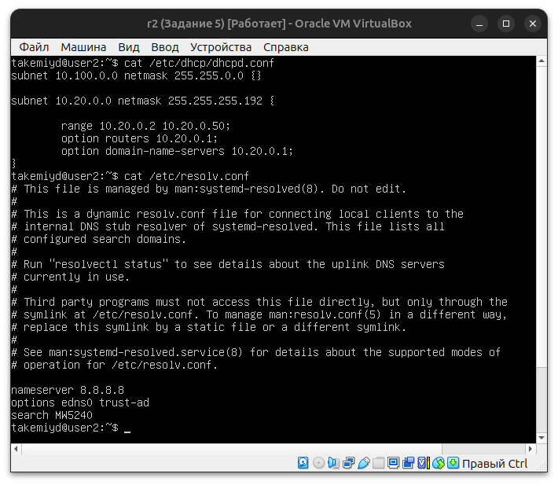

##### Перезагрузи службу **DHCP** командой `systemctl restart isc-dhcp-server`. Машину ws21 перезагрузи при помощи `reboot` и через `ip a` покажи, что она получила адрес. Также пропингуй ws22 с ws21.

- Включим DHCP в netplan и закоментируем статические IP
- Перезагружаем компуктер
- Пропингуем машину ws21

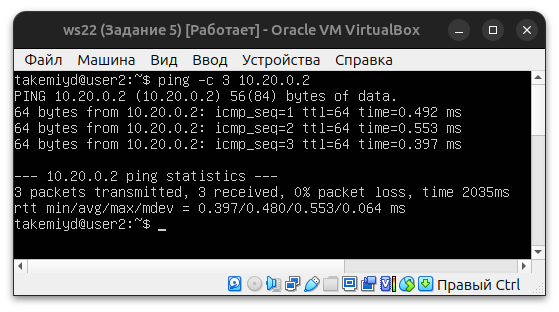

##### Укажи MAC-адрес у ws11, для этого в *etc/netplan/00-installer-config.yaml* надо добавить строки: `macaddress: 10:10:10:10:10:BA`, `dhcp4: true`.
- Добавляем в netplan conf macaddress и проверяем чтобы он соотвествовал в virtualbox

 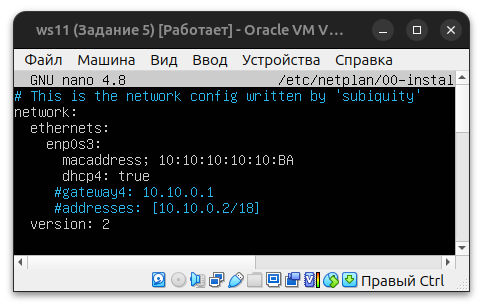

##### Для r1 настрой аналогично r2, но сделай выдачу адресов с жесткой привязкой к MAC-адресу (ws11). Проведи аналогичные тесты.

- Устанавливаем `isc-dhcp-server` на r1
- Корректируем `/etc/dhcp/dhcpd.conf` добавляем в него 
```sh
subnet 10.100.0.0 netmask 255.255.0.0 {}
subnet 10.10.0.0 netmask 255.255.192.0 
    range 10.10.0.3 10.10.0.50;
    option routers 10.10.0.1;
    option domain-name-servers 10.10.0.1;

host ws11
    harware etherner 10:10:10:10:10:BA;
    fixed-address 10.10.0.2;
```
- Прописываем на ws 11 новый netplan в который добавляем macaddress
- Проверяем командой ip a айпишник и затем пробуем пингануть r1

 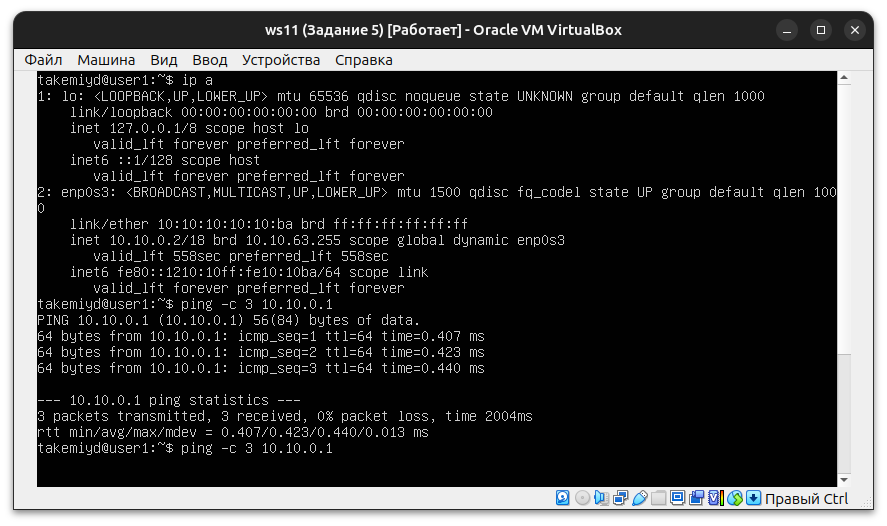


##### Запроси с ws21 обновление IP-адреса.

 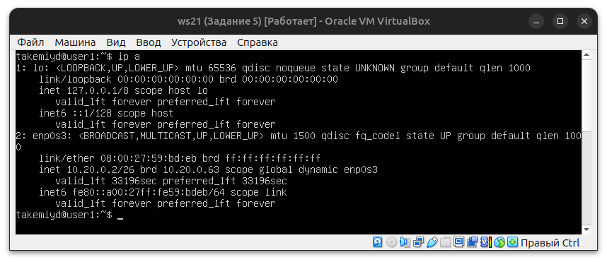

##### Сохрани дампы образов виртуальных машин.
**P.S. Ни в коем случае не сохраняй дампы в гит!**

## Part 7. **NAT**

*В данном задании используются виртуальные машины из Части 5.*
##### В файле */etc/apache2/ports.conf* на ws22 и r1 измени строку `Listen 80` на `Listen 0.0.0.0:80`, то есть сделай сервер Apache2 общедоступным.

- Установим apache `sudo apt install apache2` 
- Внесем изменения в conf. файле
 
 - r1

 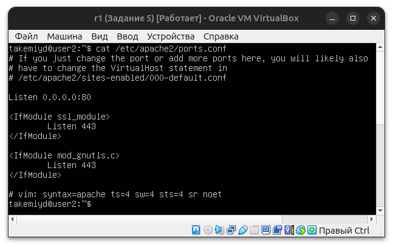

- ws22

 

##### Запусти веб-сервер Apache командой `service apache2 start` на ws22 и r1.
 
- r1 

 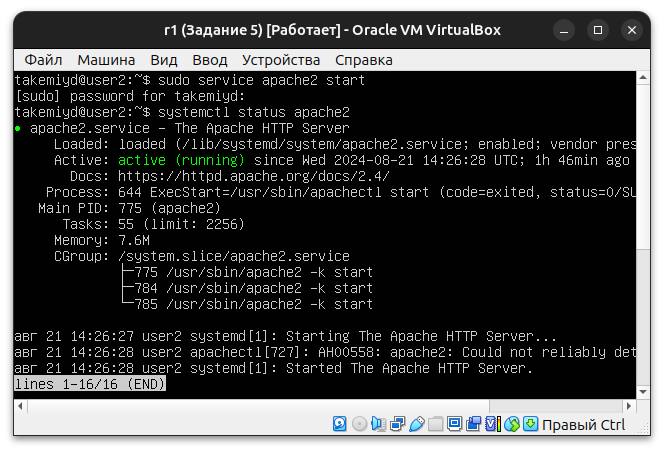

- ws22

 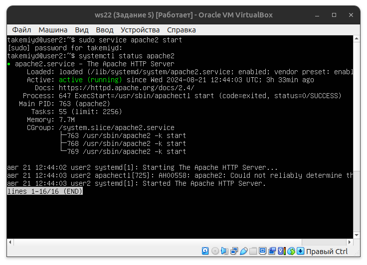


##### Добавь в фаервол, созданный по аналогии с фаерволом из Части 4, на r2 следующие правила:
##### 1) Удаление правил в таблице filter — `iptables -F`;
##### 2) Удаление правил в таблице «NAT» — `iptables -F -t nat`;
##### 3) Отбрасывать все маршрутизируемые пакеты — `iptables --policy FORWARD DROP`.
 Настройка брандмауэра на r2
Шаг 1: Удаление текущих правил

    Удаление правил в таблице filter: iptables -F
    Удаление правил в таблице NAT: iptables -F -t nat

Эти команды очищают все существующие правила в таблицах filter и NAT. Таблица filter используется для фильтрации трафика, а таблица NAT — для трансляции сетевых адресов.
Шаг 2: Отбрасывание маршрутизируемых пакетов

    Команда: iptables --policy FORWARD DROP

Эта команда задает политику по умолчанию для цепочки FORWARD, которая отвечает за маршрутизацию пакетов между интерфейсами. Политика DROP означает, что все маршрутизируемые пакеты будут отброшены, если нет других разрешающих правил.

##### Запусти файл также, как в Части 4.
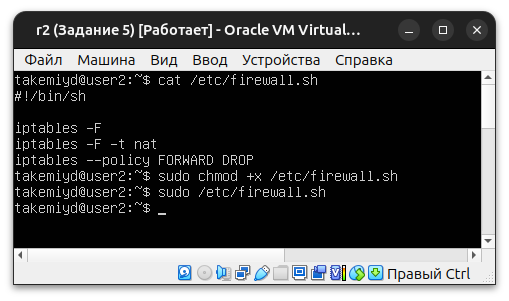
##### Проверь соединение между ws22 и r1 командой `ping`.

После выполнения вышеуказанных команд попробуйте выполнить команду ping с r1 на ws22. Соединение должно быть заблокировано, поскольку все маршрутизируемые пакеты теперь отбрасываются.

 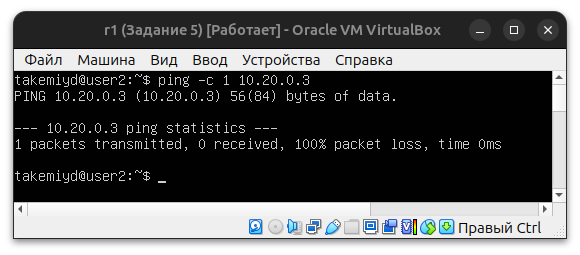


##### Добавь в файл ещё одно правило:
##### 4) Разрешить маршрутизацию всех пакетов протокола **ICMP**.
##### Запусти файл также, как в Части 4.

##### Проверь соединение между ws22 и r1 командой `ping`.
Это правило разрешает все пакеты протокола ICMP (например, для ping) в цепочке FORWARD. После добавления этого правила трафик ICMP между ws22 и r1 должен быть разрешен.
 
##### Добавь в файл ещё два правила:
##### 5) Включи **SNAT**, а именно маскирование всех локальных IPиз локальной сети, находящейся за r2 (по обозначениям из Части 5 — сеть 10.20.0.0).
##### 6) Включи **DNAT** на 8080 порт машины r2 и добавить к веб-серверу Apache, запущенному на ws22, доступ извне сети.

1. Маскирование исходящих соединений из сети 10.20.0.0/26

    - Используйте SNAT или MASQUERADE для изменения IP-адреса исходящих пакетов:
    - `iptables -t nat -A POSTROUTING -s 10.20.0.0/26 -o eth0 -j MASQUERADE`

4. Разрешение маршрутизации из внутреннего интерфейса на внешний

    - `iptables -A FORWARD -i eth1 -o eth0 -j ACCEPT`

5. Разрешение возврата пакетов для уже установленных соединений

    - `iptables -A FORWARD -i eth0 -o eth1 -m state --state ESTABLISHED,RELATED -j ACCEPT`

6. Настройка DNAT для проброса порта 8080 на 80 порт внутреннего сервера (ws22)

    - `iptables -t nat -A PREROUTING -i eth0 -p tcp --dport 8080 -j DNAT --to-destination 10.20.0.22:80`

Полная последовательность команд:

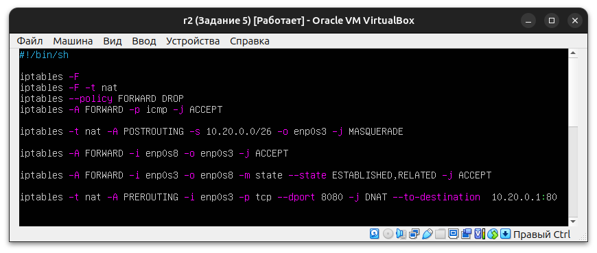


##### Запусти файл также, как в Части 4.
##### Проверь соединение по TCP для **SNAT**: для этого с ws22 подключиться к серверу Apache на r1 командой:

- с ws22 на r1 

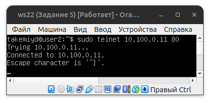


##### Проверь соединение по TCP для **DNAT**: для этого с r1 подключиться к серверу Apache на ws22 командой `telnet` (обращаться по адресу r2 и порту 8080).

- c r1 на ws22

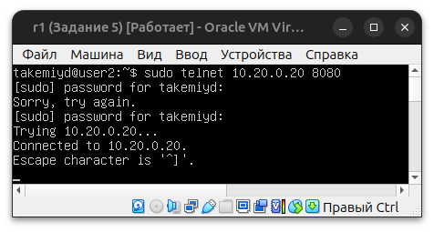

[iptable ПОлезная ссылка ](https://selectel.ru/blog/setup-iptables-linux/)


##### Сохрани дампы образов виртуальных машин.
**P.S. Ни в коем случае не сохраняй дампы в гит!**

## Part 8. Дополнительно. Знакомство с **SSH Tunnels**

##### Запусти на r2 фаервол с правилами из Части 7.

Запускаем наш фаервол

- 

##### Запусти веб-сервер **Apache** на ws22 только на localhost (то есть в файле */etc/apache2/ports.conf* измени строку `Listen 80` на `Listen localhost:80`).

Меняем Listen

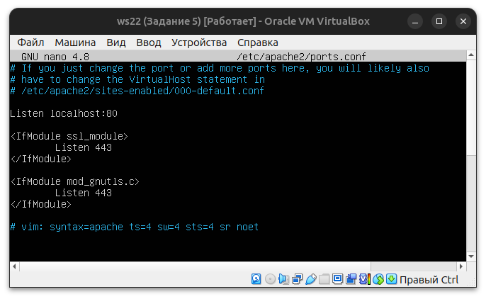

##### Воспользуйся *Local TCP forwarding* с ws21 до ws22, чтобы получить доступ к веб-серверу на ws22 с ws21.

Используем команду `sudo ssh -L 8080:localhost:80 takemiyd@10.20.0.3` на машине 21

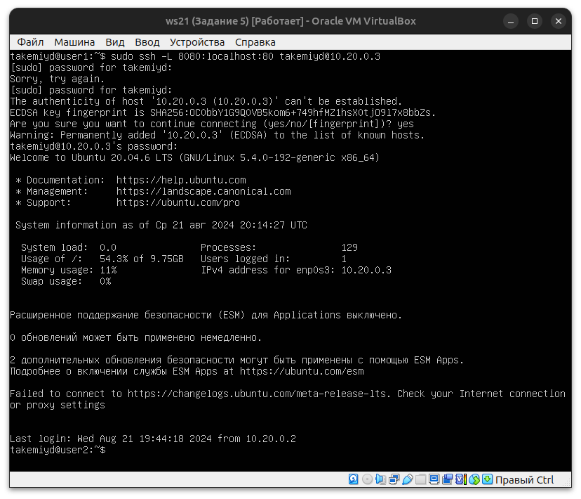


##### Воспользуйся *Remote TCP forwarding* c ws11 до ws22, чтобы получить доступ к веб-серверу на ws22 с ws11.

Используем команду `ssh -R 8080:localhost:80 takemiyd@10.20.0.3` на машине 11

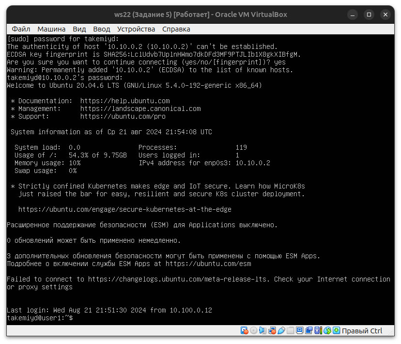

##### Для проверки, сработало ли подключение в обоих предыдущих пунктах, перейди во второй терминал (например, клавишами Alt + F2) и выполни команду:

`telnet 127.0.0.1 [локальный порт]`

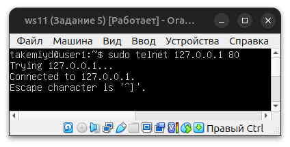


##### Сохрани дампы образов виртуальных машин.
**P.S. Ни в коем случае не сохраняй дампы в гит!**

